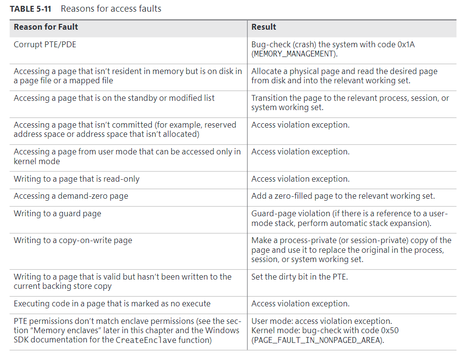
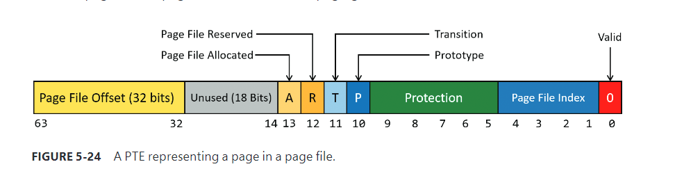

# invalid PTEs

### Page file

The page file offset is always non-zero and never all ones  to allow for other formats, described next

### Demand zero

This PTE format is the same as the page file PTE shown in the previous entry but the ==page file offset is zero==. The desired page must be satisfied with a page of zeroes. The pager looks at the zero page list. If the list is empty, the pager takes a page from the free list and zeroes it. If the free list is also empty, it takes a page from one of the standby lists and zeroes it.

### Virtual Address Descriptor

This PTE format is the same as the page file PTE shown previously but in this case the ==page file offset field is all one==. This indicates a page whose definition and backing store, if any, can be found in the process’s Virtual Address Descriptor (VAD) tree. This format is used for pages that are backed by sections in mapped files. The pager finds the VAD that defines the virtual address range encompassing the virtual page and initiates an in-page operation from the mapped file referenced by the VAD

### Transition

The transition bit is one. The desired page is in memory on either the standby, modified, or modified-no-write list or not on any list. The pager will remove the page from the list (if it is on one) and add it to the process working set. This is known as a soft page fault because no I/O is involved

### Unknown 

The PTE is zero or the page table doesn’t yet exist.(The PDE that would provide the physical address of the page table contains zero.)  In both cases, the memory manager must examine the VADs to determine whether this virtual address has been committed.If so, page tables are built to represent the newly committed address space.If not—that is, if the page is reserved or hasn’t been defined at all—the page fault is reported as an access violation exception.