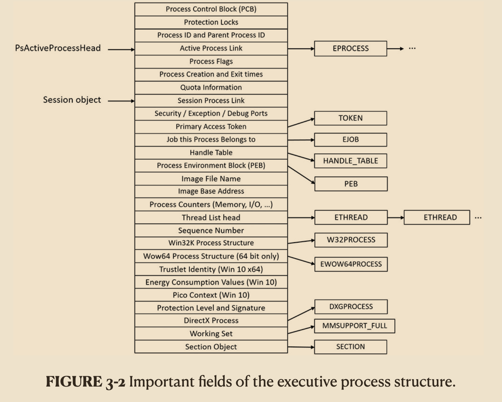
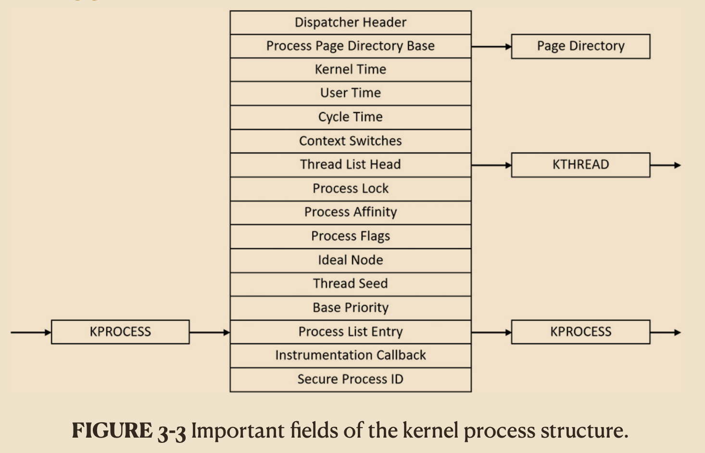
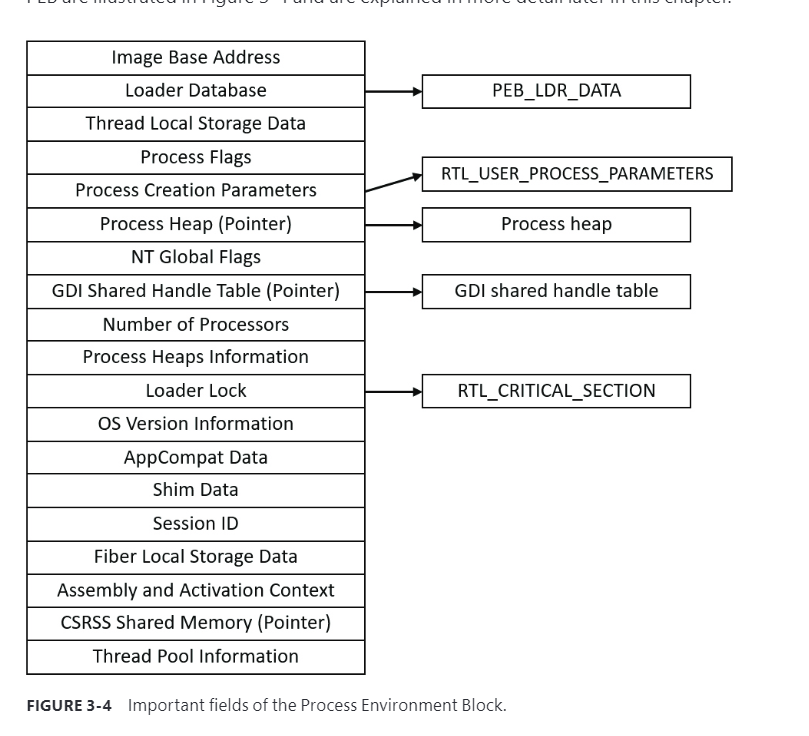
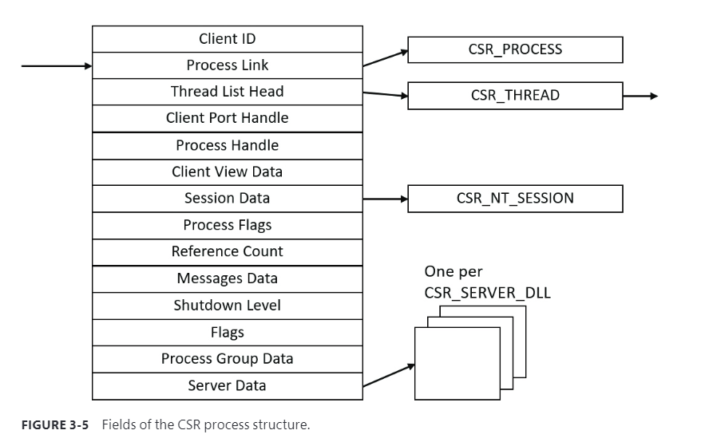
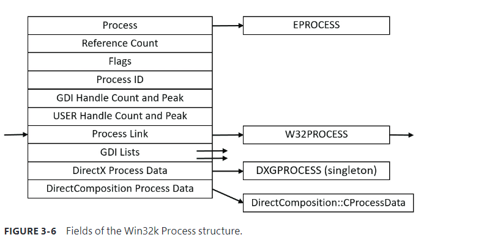

the first member of the executive process structure is called Pcb (Process Control Block). It is a structure of type KPROCESS, for kernel process. Although routines in the executive store information in the EPROCESS, the dispatcher, scheduler, and interrupt/time accounting code—being part of the operating system kernel—use the KPROCESS instead

