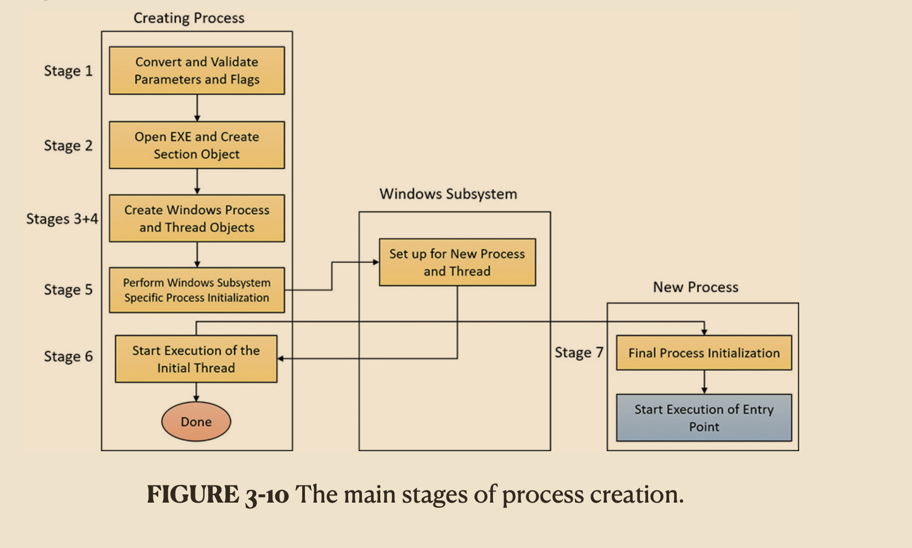

# 1.Validate parameters; convert Windows subsystem flags and options to their native counterparts; parse, validate, and convert the attribute list to its native counterpart.

# 2.Open the image file (.exe) to be executed inside the process.”

# 3.Create the Windows executive process object.

# 4.Create the initial thread (stack, context, and Windows executive thread object)

# 5.Perform post-creation, Windows subsystem–specific process initialization.

# 6.Start execution of the initial thread (unless the CREATE\_SUSPENDED flag was specified)

# 7.In the context of the new process and thread, complete the initialization of the address space (for example, load required DLLs) and begin execution of the program’s entry point.
