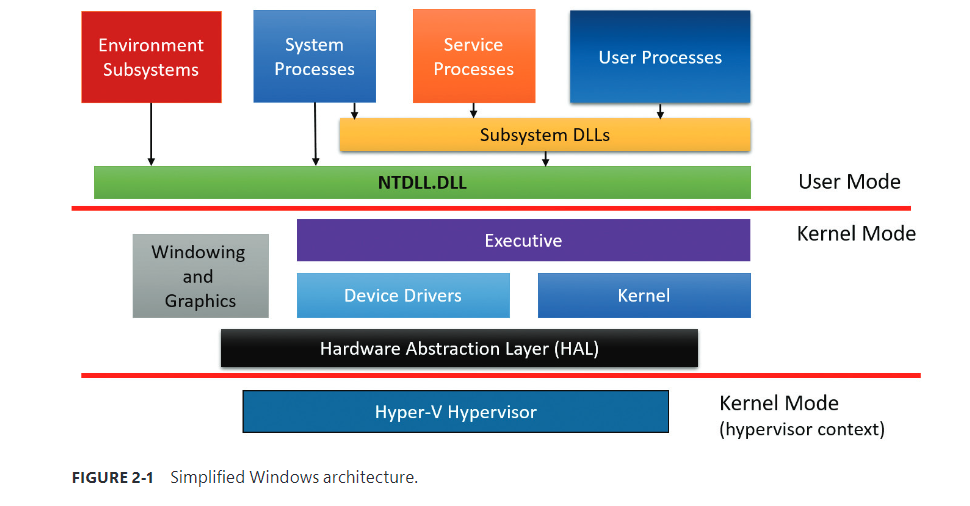
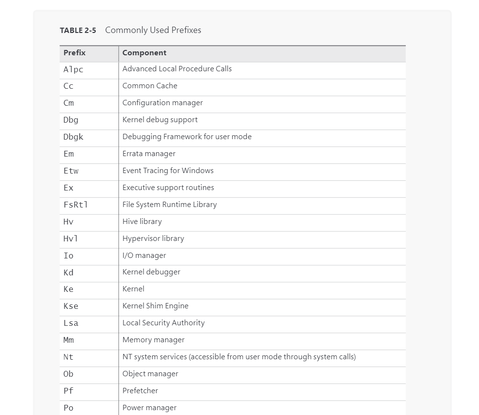
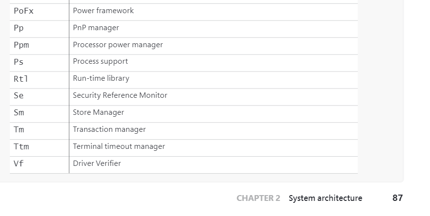
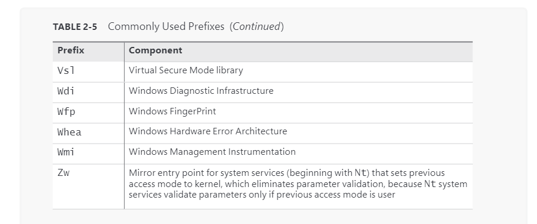
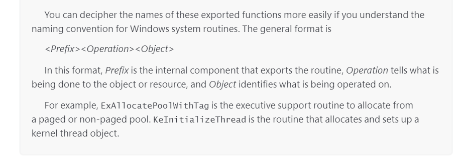

# Architecture overview

# show driver

To list the installed drivers, run the System Information tool (Msinfo32.exe). To launch this tool, click Start and then type Msinfo32 to locate it. Under System Summary, expand Software Environment and open System Drivers. Here’s an example output of the list of installed drivers

Alternatively, you can list the currently loaded device drivers by selecting the ==System== process in Process Explorer and opening the DLL view. Here’s a sample output. (To get the extra columns, right-click a column header and click Select Columns to see all the available columns for modules in the DLL tab.)

