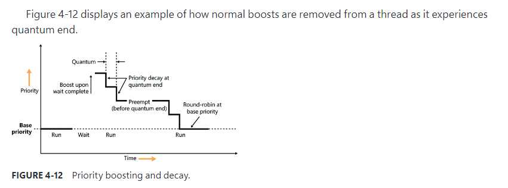

Windows的调度是在线程粒度上进行的，进程只是为线程提供运行时需要的资源。因此调度选者时，不会考虑线程所属的进程。

# 优先级

Windows内部使用32个优先级，从0到31不等

- 16个实时级别（16到31）
- 16可变级别（0到15），其中0级是为零页面线程保留的

线程优先级级别从两个不同的角度分配：Windows API和Windows内核。Windows API首先按创建进程时分配给的优先级类来组织（括号中的数字表示内核识别的内部PROCESS_PRIORITY_CLASS索引）

- Real-Time (4)  `PspPriorityTable[4] == 24`
- High (3)  `PspPriorityTable[3] == 13`
- Above Normal (6) `PspPriorityTable[6] == 10`
- Normal (2) `PspPriorityTable[2] == 8`
- Below Normal (5) `PspPriorityTable[5] == 6`
- Idle (1) `PspPriorityTable[1] == 4`

Windows API SetPriorityClass允许将进程的优先级类更改为这些级别之一。

然后，它为这些进程中的单个线程分配相对优先级。在这里，数字代表一个优先增量，被应用于进程基础优先级

- Time-Critical (15)
- Highest (2)
- Above-Normal (1)
- Normal (0)
- Below-Normal (–1)
- Lowest (–2)
- Idle (–15)

这些值可以传递给SetThreadPriority Windows API，以更改线程的相对优先级。

因此，在Windows API中，每个线程都有一个基本优先级，这是其进程优先级类和相对线程优先级的函数。在内核中，使用PspPriorityTable全局数组和前面显示的PROCESS_PRIORITY_CLASS索引==将进程优先级类转换为基本优先级==，该索引分别设置了4、8、13、24、6和10的优先级。然后将相对线程优先级作为差分应用于此基本优先级。例如，最高线程（Highest）将获得比其进程的基本优先级高两个级别的线程基础优先级。

如表4-1所示，线程具有从Windows API查看的七个可能的优先级级别（高优先级类别的六个级别）

无论该线程的优先级如何使用Windows API设置，从调度程序的角度来看，最终结果很重要。例如，优先级10可以通过两种方式获得：a Normal priority class process (8) with a thread relative priority of Highest (+2), or an Above-Normal priority class process (10) and a Normal thread relative priority (0). from the scheduler’s perspectives, these settings lead to the same value (10), so these threads are identical(完全相同的) in terms of their priority

# 线程状态

- `Ready`:A thread in the ready state is waiting to execute or to be in-swapped after completing a wait. When looking for a thread to execute, the dispatcher considers only the threads in the ready state
- `Deferred ready`:This state is used for threads that have been selected to run on a specific processor but have not actually started running there. This state exists so that the kernel can minimize the amount of time the per-processor lock on the scheduling database is held.
- `Standby`:A thread in this state has been selected to run next on a particular processor. When the correct conditions exist, the dispatcher performs a context switch to this thread. Only one thread can be in the standby state for each processor on the system. Note that a thread can be preempted out of the standby state before it ever executes (if, for example, a higher-priority thread becomes runnable before the standby thread begins execution).
- `Running`:After the dispatcher performs a context switch to a thread, the thread enters the running state and executes. The thread’s execution continues until its quantum ends (and an-other thread at the same priority is ready to run), it is preempted by a higher-priority thread, it terminates, it yields execution, or it voluntarily enters the waiting state.
- `Waiting`:A thread can enter the waiting state in several ways: A thread can voluntarily wait for an object to synchronize its execution, the OS can wait on the thread’s behalf (such as to resolve a paging I/O), or an environment subsystem can direct the thread to suspend itself. When the thread’s wait ends, depending on its priority, the thread either begins running immediately or is moved back to the ready state
- `Transition`:A thread enters the transition state if it is ready for execution but its kernel stack is paged out of memory. After its kernel stack is brought back into memory, the thread enters the ready state. 
- `Terminated`:When a thread finishes executing, it enters this state. After the thread is terminated, the executive thread object (the data structure in system memory that describes the thread) might or might not be deallocated. The object manager sets the policy regarding when to  delete the object. For example, the object remains if there are any open handles to the thread. A thread can also enter the terminated state from other states if it’s killed explicitly by some other thread—for example, by calling the TerminateThread Windows API.
- `Initialized`:This state is used internally while a thread is being created.

# 调度队列

To improve scalability, including thread-dispatching concurrency, Windows multiprocessor systems have per-processor dispatcher ready queues and shared processor group queues, as illustrated in Figure 4-9

Windows versions prior to Windows 8 and Windows Server 2012 used per-processor ready queues and a per-processor ready summary, which were stored as part of processor control block (PRCB) structure. (To see the fields in the PRCB, type dt nt!_kprcb in the kernel debugger.) Starting with Windows 8 and Windows Server 2012, a shared ready queue and ready summary are used for a group of processors. This enables the system to make better decisions about which processor to use next for that group of processors. (The per-CPU ready queues are still there and used for threads with affinity constraints.)

The ready queues, ready summary (described next), and some other information is stored in a kernel structure named KSHARED_READY_QUEUE that is stored in the PRCB(Processor control block). Although it exists for every processor, it’s used only on the first processor of each processor group, sharing it with the rest of the processors in that group.

The dispatcher ready queues (ReadListHead in KSHARED_READY_QUEUE) contain the threads that are in the ready state, waiting to be scheduled for execution. There is one queue for each of the 32 priority levels. To speed up the selection of which thread to run or preempt, Windows maintains a 32-bit bitmask called the ready summary (ReadySummary). Each bit set indicates one or more threads in the ready queue for that priority level (bit 0 represents priority 0, bit 1 priority 1, and so on).

# Quantum

As mentioned earlier in the chapter, a quantum is the amount of time a thread is permitted to run before Windows checks to see whether another thread at the same priority is waiting to run.

thread run-time accounting is based on processor cycles

When the system starts up, it multiplies the processor speed (CPU clock cycles per second) in hertz (Hz) by the number of seconds it takes for one clock tick to fire(current interval =  KeMaximumIncrement value) to calculate the number of clock cycles to which ==each== ==quantum== is equivalent.This value is stored in the kernel variable ==KiCyclesPerClockQuantum==

The result of this accounting method is that threads do not actually run for a quantum number based on clock ticks. Instead, they run for a ==quantum target==, which represents an estimate of what the number of ==CPU clock cycles== the thread has consumed should be when its turn would be given up

### Quantum accounting

Each process has a quantum reset value in the process control block (==KPROCESS QuantumReset== ). This value is used when creating new threads inside the process and is duplicated in the thread control block (KTHREAD), which is then used when giving a thread a new quantum target. The quantum reset value is stored in terms of actual quantum units (we’ll discuss what these mean soon), which are then multiplied by the number of clock cycles per quantum, resulting in the ==quantum target==.

Internally, a quantum unit is represented as one-third of a clock tick.That is, one clock tick equals three quantums. For this reason, the ==KiCyclesPerClockQuantum== value is divided by 3 at the end of the calculation previously described, because the original value describes only CPU clock cycles per clock interval timer tick.

### EXPERIMENT: Determining the clock cycles per quantum

quantum(KiCyclesPerClockQuantum) = (CPU clock cycles that occur 
each second) * (clock interval timer fires each second(KeMaximumIncrement)) /3

The Windows GetSystemTimeAdjustment function returns the clock interval

windbg !cpuinfo  command get cpu frequence

### Variable quantums

When variable quantums are enabled, the variable quantum table (PspVariableQuantums), which holds an array of six quantum numbers, is loaded into the ==PspForegroundQuantum== table (a three-element array) that is used by the PspComputeQuantum function. Its algorithm will pick the appropriate quantum index based on whether the process is a foreground proces--that is, whether it contains the thread that owns the foreground window on the desktop. If this is not the case, an index of 0 is chosen, which corresponds to the default thread quantum described earlier. If it is a foreground process, ==the quantum index corresponds to the priority separation==.

### Quantum settings registry value

 dd nt!PsPrioritySeparation L1
 
 db nt!PspForegroundQuantum L3
 
  dt nt!_KPROCESS ffffe001'4f51f080 QuantumReset
  
 
 
 # Priority boosts
 
 ####  Boosts due to scheduler/dispatcher events (latency reduction)
 
 Whenever a dispatch event occurs, the KiExitDispatcher routine is called. Its job is to process the deferred ready list by calling KiProcessThreadWaitList and then call KzCheckForThreadDispatch to check whether any threads on the current processor should not be scheduled
 
 - AdjustBoost dispatch events
 - AdjustUnwait dispatch event
 
- **Unwait boosts**

Unwait boosts attempt to decrease the latency between a thread waking up due to an object being signaled (thus entering the ready state) and the thread actually beginning its execution to process the unwait (thus entering the running state). Generally speaking, it is desirable that a thread that wakes up from a waiting state would be able to run as soon as possible

All these boosts of 1 attempt to solve the initial problem by assuming that both the releasing and waiting threads are running at the same priority. By boosting the waiting thread by one priority level, the waiting thread should preempt the releasing thread as soon as the operation completes. 
 
- **Lock-ownership boosts**

Because the executive-resource (ERESOURCE) and critical-section locks use underlying dispatcher ob-
jects, releasing these locks results in an unwait boost as described earlier. On the other hand, because the high-level implementation of these objects tracks the owner of the lock, the kernel can make a more informed decision as to what kind of boost should be applied by using the AdjustBoost reason. In these kinds of boosts, AdjustIncrement is set to the current priority of the releasing (or setting) thread, minus any graphical user interface (GUI) foreground separation boost. In addition, before the KiExitDispatcher function is called, KiRemoveBoostThread is called by the event and gate code to return the releasing thread back to its regular priority. This step is needed to avoid a lock-convoy situation, in which two threads repeatedly passing the lock between one another get ever-increasing boosts
 
#### Boosts due to I/O completion (latency reduction)
 
Windows gives temporary priority boosts upon completion of certain I/O operations so that threads that were waiting for an I/O have more of a chance to run right away and process whatever was being waited for. 
 
#### Boosts due to user interface (UI) input (latency reduction/responsiveness)

As will be described shortly, whenever a thread in the foreground process completes a wait operation on a kernel object, the kernel boosts its current (not base) priority by the current value of ==PsPrioritySeparation==.
 
==As described earlier in this chapter in the section “Controlling the quantum,” PsPrioritySeparation reflects the quantum-table index used to select quantums for the threads of foreground applications.==

The reason for this boost is to improve the responsiveness of interactive applications. By giving the foreground application a small boost when it completes a wait, it has a better chance of running right away, especially when other processes at the same base priority might be running in the background.
 
Threads that own windows receive an additional boost of 2 when they wake up because of windowing activity such as the arrival of window messages. The windowing system (Win32k.sys) applies this boost when it calls KeSetEvent to set an event used to wake up a GUI thread. The reason for this boost is similar to the previous one: to favor interactive applications
 
#### Boosts due to a thread waiting on an executive resource (ERESOURCE) for too long (starvation avoidance)
 
When a thread attempts to acquire an executive resource (ERESOURCE; see Chapter 8 in Part 2 for more information on kernel-synchronization objects) that is already owned exclusively by another thread, it must enter a wait state until the other thread has released the resource. To limit the risk of deadlocks, the executive performs this wait in intervals of 500 ms instead of doing an infinite wait on the resource. At the end of these 500 ms, if the resource is still owned, the executive attempts to prevent CPU starvation by acquiring the dispatcher lock, boosting the ==owning== thread or threads to 15 (if the original owner prior-ity is less than the waiter’s and not already 15), resetting their quantums, and performing another wait.

Because executive resources can be either shared or exclusive, the kernel first boosts the exclusive owner and then checks for shared owners and boosts all of them. ==When the waiting thread enters the wait state again, the hope is that the scheduler will schedule one of the owner threads, which will have enough time to complete its work and release the resource==. Note that this boosting mechanism is used only if the resource doesn’t have the Disable Boost flag set, which developers can choose to set if the priority-inversion mechanism described here works well with their usage of the resource.
 
#### Boosts when a thread that’s ready to run hasn’t been running for some time (starvation and priority-inversion avoidance)

Imagine the following situation: A priority 7 thread is running, preventing a priority 4 thread from ever receiving CPU time. However, a priority 11 thread is waiting for some resource that the priority 4 thread has locked. But because the priority 7 thread in the middle is eating up all the CPU time, the priority 4 thread will never run long enough to finish whatever it’s doing and release the resource blocking the priority 11 thread. This scenario is known as ==priority inversion.==

You saw how the code responsible for executive resources manages this scenario by boosting the owner threads so that they can have a chance to run and release the resource

However, executive resources are only one of the many synchronization constructs available to developers, and the boosting technique will not apply to any other primitive. Therefore, Windows also includes a generic CPU starvation-relief mechanism as part of a thread called the balance-set manager.Once per second, this thread scans the ready queues for any threads that have been in the ready state (that is, haven’t run) for approximately 4 seconds.

If it finds such a thread, the balance set manager boosts the thread’s priority to 15 and sets the quantum target to an equivalent CPU clock cycle count of 3 quantum units.After the quantum expires, the thread’s priority decays immediately .to its original base priority. If the thread wasn’t finished and a higher-priority thread is ready to run, the decayed thread returns to the ready queue, where it again becomes eligible for another boost if it remains there for another 4 seconds

#### Applying boosts

Back in ==KiExitDispatcher==, you saw that ==KiProcessThreadWaitList== is called to process any threads in the deferred ready list. 

This is done by looping through each DeferredReady thread, unlinking its wait blocks. unlinking its wait blocks (only Active and Bypassed blocks are unlinked), and setting two key values in the kernel’s thread control block: ==AdjustReason== and ==AdjustIncrement==

==KiDeferredReadyThread== is then called. This makes the thread ready for execution by running  two algorithms: ==the quantum and priority selection algorithm== and  the ==processor selection algorithm==

For an ==AdjustUnwait== boost, it will be applied only if the thread is not already experiencing an unusual boost and only if the thread has not disabled boosting . Another situation that can disable boosting in this case is if the kernel has realized that the thread has actually exhausted its quantum and it has come out of a wait that lasted less than two clock ticks.

If these situations are not currently true, the new priority of the thread will be computed by adding the AdjustIncrement to the thread’s current base priority. Additionally, if the thread is known to be part of a foreground process,this is where the priority-separation boost (PsPrioritySeparation) is applied by adding its value on top of the new priority. 

For ==AdjustBoost== boosts, the kernel checks whether the thread’s current priority is lower than the AdjustIncrement (recall this is the priority of the setting thread) and whether the thread’s current pri-ority is below 13.

#### Removing boosts

Removing boosts is done in ==KiDeferredReadyThread== as boosts and quantum recomputations are being applied

For an AdjustNone scenario, which means the thread became ready perhaps due to a preemption.

Priority recomputation happens on non-real-time threads. It’s done by taking the thread’s current priority, subtracting its foreground boost, subtracting its unusual boost (the combination of these last two items is the PriorityDecrement), and finally subtracting 1.This new priority is bounded with the base priority as the lowest bound and any existing priority decrement is zeroed out (clearing unusual and foreground boosts). This means that in the case of a lock-ownership boost or any of the other unusual boosts explained, the entire boost value is now lost. On the other hand, for a regular AdjustUnwait boost, the priority naturally trickles down by 1 due to the subtraction by 1. This lowering eventually stops when the base priority is hit due to the lower bound check

There is another instance where boosts must be removed, which goes through the ==KiRemoveBoostThread== function. This is a special-case boost removal that occurs due to the lock-ownership boost rule, which specifies that the setting thread must lose its boost when donating its current priority to the waking thread 

