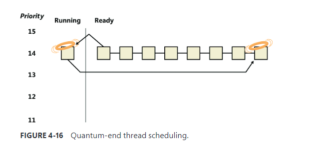

A typical context switch requires saving and reloading the following data:

- Instruction pointer
- kernel stack pointer
- A pointer to the address space in which the thread runs

# Direct Switch

Windows 8 and Server 2012 introduced an optimization called Direct Switch, that allows a thread to ==donate its quantum== and boost to another thread, ==which is then immediately scheduled on the same processor==

The scheduler has no way of knowing that the first thread (T1 in Figure 4-13) is about to enter a wait state after signaling some synchronization object that the second thread (T2) is waiting on. Therefore, a special function must be called to let the scheduler know that this is the case (atomic signal and wait).

If possible, the ==KiDirectSwitchThread== function performs the actual switch. It’s called by KiExitDispatcher if passed a flag indicating to use Direct Switch if possible.

Direct Switch can fail,for example, if the target thread’s affinity precludes it from running on the current processor. However, if it succeeds, the ==quantum== of the first thread is transferred to the target thread and the first thread loses its remaining quantum.

Direct Switch is currently used in the following scenarios:

- If a thread calls the SignalObjectAndWait Windows API
- ALPC 
- Synchronous remote procedure call (RPC) calls
- COM remote calls (currently MTA [multithreaded apartment] to MTA only)

# Scheduling scenarios 

### Voluntary switch

A thread might voluntarily relinquish use of the processor by entering a wait state on some object  (such as an event, a mutex, a semaphore, an I/O completion port, a process, a thread, and so on) by calling one of the Windows wait functions such as ==WaitForSingleObject== or ==WaitForMultipleObjects==. 

### Preemption

In this scheduling scenario,a lower-priority thread is preempted when a higher-priority thread becomes ready to run.This situation might occur for a couple of reason:

- A higher priority thread's wait completes
- A thread priority is increased or decreased.

In either of these cases, Windows must determine whether the currently running thread should continue to run or be preempted to allow a higher-priority thread to run.

When a thread is preempted, it is put at the head of the ready queue for the priority it was running at.

### Quantum end

When the running thread exhausts its CPU quantum, Windows must determine whether the thread’s priority should be decremented and then whether another thread should be scheduled on the processor.

As you saw, instead of simply relying on a clock interval timer–based quantum to schedule threads, Windows uses an a ==ccurate CPU clock cycle count to maintain quantum targets==. Windows also uses this count to determine whether quantum end is currently appropriate for the thread--something that might have happened previously and is important to discuss.

Using a scheduling model that relies only on the clock interval timer, the following situation can occur:

- Threads A and B become ready to run during the middle of an interval.
- Thread A starts running but is interrupted for a while. The time spent handling the interrupt is charged to the thread.
- Interrupt processing finishes and thread A starts running again, but it quickly hits the next clock interval. The scheduler can assume only that thread A had been running all this time and now switches to thread B
- Thread B starts running and has a chance to run for a full clock interval (barring preemption or interrupt handling)

In this scenario, thread A was unfairly penalized(处罚) in two different ways. First, the time it spent handling a device interrupt was counted against its own CPU time, even though the thread probably had nothing to do with the interrupt. It was also unfairly penalized((处罚)) for the time the system was idling inside that clock interval before it was scheduled.

Windows keeps an accurate count of the exact number of CPU clock cycles spent doing work that the thread was scheduled to do (which means excluding interrupts).It also keeps a quantum target of clock cycles that should have been spent by the thread at the end of its quantum.Therefore, both of the unfair decisions that would have been made against thread A as described in the preceding paragraph will not happen in Windows. Instead, the following situation occurs:

- Threads A and B become ready to run during the middle of an interval
- Thread A starts running but is interrupted for a while. The CPU clock cycles spent handling the interrupt are not charged to the thread.
- Interrupt processing finishes and thread A starts running again, but it quickly hits the next clock interval. The scheduler looks at the number of CPU clock cycles charged to the thread and compares them to the expected CPU clock cycles that should have been charged at quantum end
- Because the former number is much smaller than it should be, the scheduler assumes that thread A started running in the middle of a clock interval and might have been additionally interrupted.
- Thread A gets its quantum increased by another clock interval, and the quantum target is recalculated. Thread A now has its chance to run for a full clock interval
- At the next clock interval, thread A has finished its quantum, and thread B now gets a chance to run.

# Idle threads

When no runnable thread exists on a CPU, Windows dispatches that CPU’s idle thread.Each CPU’s idle thread is found via a pointer in that CPU’s PRCB.

All the idle threads belong to the idle process.The idle process and idle threads are special cases in many ways. They are, of course, represented by EPROCESS/KPROCESS and ETHREAD/KTHREAD structures, but they are not executive manager processes and thread objects. Nor is the idle process on the system process list.

The initial idle thread and idle process structures are statically allocated and used to bootstrap the system before the process manager and the object manager are initialized. Subsequent idle thread structures are  allocated dynamically (as simple allocations from a non-paged pool, bypassing the object manager)  as additional processors are brought online. Once process management initializes, it uses the special variable ==PsIdleProcess== to refer to the idle process

Perhaps the most interesting anomaly regarding the idle process is that Windows reports the priority of the idle threads as 0. In reality, however, the values of the idle threads’ priority members are irrelevant because these threads are selected for dispatching only when there are no other threads to run. Their priority is never compared with that of any other thread. Nor is it used to put an idle thread on a ready queue, as idle threads are never part of any ready queues. (Only one thread per Windows system is actually running at priority 0—the zero page thread, explained in Chapter 5.)

The idle thread’s routine, KiIdleLoop, performs a number of operations that preclude(排除) its being preempted by another thread in the usual fashion. When no non-idle threads are available to run on a processor, that processor is marked as idle in its PRCB.After that, if a thread is selected for execution on the idle processor, the thread’s address is stored in the NextThread pointer  of the idle processor’s PRCB. The idle thread checks this pointer on each pass through its loop.

Although some details of the flow vary between architectures (this is one of the few routines written in assembly and not in C), the basic sequence of operations of the idle thread is as follows:

# Thread suspension

Threads can be suspended and resumed explicitly with the SuspendThread and ResumeThread API functions, respectively. Every thread has a suspend count, which is incremented by suspension and decremented by resuming. If the count is 0, the thread is free to execute. Otherwise, it will not execute

Suspension works by queuing a kernel APC to the thread. When the thread is switched in to execute, the APC is executed first. This puts the thread in a wait state on event that is signaled when the thread is finally resumed

# (Deep)freeze

Freezing is a mechanism by which processes enter a suspended state that cannot be changed by calling ResumeThread on threads in the process.

Freezing a process means suspending all threads in such a way that ResumeThread is not able to wake. A flag in the KTHREAD structure indicates whether a thread is frozen. For a thread to be able to execute, its suspend count must be 0 and the frozen flag must be clear

Deep freeze adds another constraint: Newly created threads in the process cannot start as well. For example, if a call to CreateRemoteThreadEx is used to create a new thread in a deep-frozen process, the thread will be frozen before actually starting. This is the typical usage of the freezing capability

Process- and thread-freezing functionality is not exposed directly to user mode. It is used internally by the Process State Manager (PSM) service that is responsible for issuing the requests to the kernel fordeep freezing and thawing

# Thread selection

KiSelectNextThread: The KiSelectNextThread operation is performed only when the logical processor needs to pick but not yet run—the next schedulable thread 

KiSelectReadyThreadEx:

### Idle scheduler

Whenever the idle thread runs, it checks whether idle scheduling has been enabled. If so, the idle thread begins scanning other processors’ ready queues for threads it can run by calling KiSearchForNewThread

### CPU sets

Windows 10 and Server 2016 introduce a mechanism called CPU sets. These are a form of affinity that you can set for use by the system as a whole (including system threads activity), processes, and even individual threads. ==For example, a low-latency audio application may want to use a processor exclusively while the rest of the system is diverted to use other processors. CPU sets provide a way to achieve that==.

The documented user mode API is somewhat limited at the time of this writing. GetSystemCpuSetInformation returns an array of SYSTEM_CPU_SET_INFORMATION that contains data for each CPU set

In the current implementation, ==a CPU set is equivalent to a single CPU==. This means the returned array’s length is the number of logical processors on the system. Each CPU set is identified by its ID, which is arbitrarily selected to be 256 (0x100) plus the CPU index (0, 1, ...). These IDs are the ones that must be passed to SetProcessDefaultCpuSets and SetThreadSelectedCpuSets functions to set default CPU sets for a process and a CPU set for a specific thread, respectivel