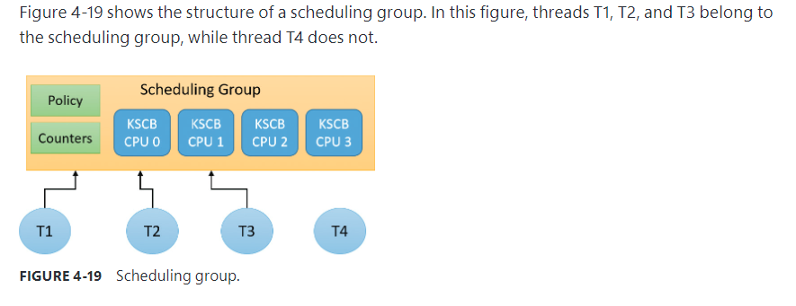

# Thread selection on multiprocessor systems

KiSearchForNewThread initially checks whether there is already a thread that was selected for this processor (by reading the NextThread field). If so, it dispatches this thread immediately in the running state. Otherwise, it calls the KiSelectReadyThreadEx routine and, if a thread was found, performs the same steps.

# processor selection

### Choosing a processor for a thread when there are idle processors

### Choosing a processor for a thread when there are no idle processors

# Group based scheduling

Windows 8 and Server 2012 introduced a group-based scheduling mechanism, built around the concept of a scheduling group (==KSCHEDULING_GROUP==). A scheduling group maintains a policy, scheduling parameters (described shortly), and a list of kernel scheduling control blocks (KSCBs), one per processor, that are part of the scheduling group. 

Here are some terms related to group scheduling:

- Generation（一代）:This is the amount of time over which to track CPU usage
- Quota(配额)：This is the amount of CPU usage allowed to a group per generation. Over quota means the group has used up all its budget（预算）. Under quota means the group has not used its full budget
- Weight：This is the relative importance of a group, between 1 and 9, where the default is 5
- Fair-share scheduling：With this type of scheduling, idle cycles can be given to threads that are over quota if no under-quota threads want to run

The KSCB structure contains CPU-related information as follows：

- Cycle usage for this generation
- Long-term average cycle usage, so that a burst of thread activity can be distinguished from a true hog
- Control flags such as hard capping, which means that even if CPU time is available above the assigned quota, it will not be used to give the thread extra CPU time
- Ready queues, based on the standard priorities (0 to 15 only because real-time threads are never part of a scheduling group)

An important parameter maintained by a scheduling group is called rank, which can be considered a scheduling priority of the entire group of threads. A rank with a value of 0 is the highest. A higher rank number means the group has used more CPU time and so is less likely to get more CPU time.

Rank always trumps priority. This means that given two threads with different ranks, the lower value rank is preferred, regardless of priority. Equal-rank threads are compared based on priority. The rank is adjusted periodically as cycle usage increases.

### Dynamic fair share scheduling

Dynamic fair share scheduling (DFSS) is a mechanism that can be used to fairly distribute CPU time among ==sessions== running on a machine