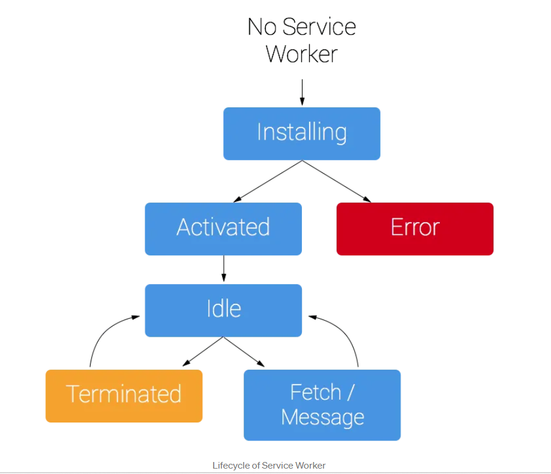

# basics

### Registering service workers

To register an extension service worker, specify it in the "==background==" field of the manifest.json file. Use the "==service_worker==" key, which specifies a single JavaScript file.

```js
{
  "name": "Awesome Test Extension",
  ...
  "background": {
    "service_worker": "service-worker.js"
  },
  ...
}
```

### Importing scripts

importing scripts into a service worker: the import statement 

To use the import statement, add the "type" field to your manifest and specify "module". For example:

```js
  "background": {
    "service_worker": "service-worker.js",
    "type": "module"
  }
```

### Initialize the state

Chrome will shut down service workers if they are not needed. We use the chrome.storage API to persist state across service worker sessions. For storage access, we need to request permission in the manifest:

manifest.json:

```js
{
  ...
  "permissions": ["storage"],
}

```

First, let's save the default suggestions to storage. We can initialize state when the extension is first installed by listening to the runtime.onInstalled() event:

```js
// Save default API suggestions
chrome.runtime.onInstalled.addListener(({ reason }) => {
  if (reason === 'install') {
    chrome.storage.local.set({
      apiSuggestions: ['tabs', 'storage', 'scripting']
    });
  }
});
```

Service workers do not have direct access to the window object, therefore cannot use window.localStorage() to store values. Also, service workers are short-lived execution environments; they get terminated repeatedly throughout a user's browser session, ==which makes it incompatible with global variables==. Instead, we use chrome.storage.local which stores data on the local machine.


### Events in service workers

All event listeners need to be statically registered in the global scope of the service worker. In other words, event listeners should not be ==nested in async functions==. This way Chrome can ensure that all event handlers are restored in case of a service worker reboot.

Event handlers in service workers need to be declared in the global scope, meaning they should be at the top level of the script and ==not be nested inside functions==. This ensures that they are registered synchronously on initial script execution, which enables Chrome to dispatch events to the service worker as soon as it starts. For example:

Not advised:

```js
chrome.storage.local.get(["badgeText"], ({ badgeText }) => {
  chrome.action.setBadgeText({ text: badgeText });
  chrome.action.onClicked.addListener(handleActionClick);
});
```

Better 

```js
chrome.action.onClicked.addListener(handleActionClick);

chrome.storage.local.get(["badgeText"], ({ badgeText }) => {
  chrome.action.setBadgeText({ text: badgeText });
});
```

### Set up a recurring event

The setTimeout() or setInterval() methods are commonly used to perform delayed or periodic tasks. However, these APIs can fail because the scheduler will cancel the timers when the service worker is terminated. Instead, extensions can use the chrome.alarms API.

Start by requesting the "alarms" permission in the manifest. Additionally, to fetch the extension tips from a remote hosted location, you need to request host permission:

manifest.json:

```js
{
  ...
  "permissions": ["storage", "alarms"],
  "host_permissions": ["https://extension-tips.glitch.me/*"],
}
```

The extension will fetch all the tips, pick one at random and save it to storage. We will create an alarm that will be triggered once a day to update the tip. Alarms are not saved when you close Chrome. So we need to check if the alarm exists and create it if it doesn't.

```js
// Fetch tip & save in storage
const updateTip = async () => {
  const response = await fetch('https://extension-tips.glitch.me/tips.json');
  const tips = await response.json();
  const randomIndex = Math.floor(Math.random() * tips.length);
  return chrome.storage.local.set({ tip: tips[randomIndex] });
};

const ALARM_NAME = 'tip';

// Check if alarm exists to avoid resetting the timer.
// The alarm might be removed when the browser session restarts.
async function createAlarm() {
  const alarm = await chrome.alarms.get(ALARM_NAME);
  if (typeof alarm === 'undefined') {
    chrome.alarms.create(ALARM_NAME, {
      delayInMinutes: 1,
      periodInMinutes: 1440
    });
    updateTip();
  }
}

createAlarm();

// Update tip once a the day
chrome.alarms.onAlarm.addListener(updateTip);
```

### Communicate with other contexts

(content scripts)The following code sends a message to the service worker requesting the tip
```js
// Sends a message to the service worker and receives a tip in response
  const { tip } = await chrome.runtime.sendMessage({ greeting: 'tip' });
```

The final step is to add a message handler to our service worker that sends a reply to the content script with the daily tip.

```js
// Send tip to content script via messaging
chrome.runtime.onMessage.addListener((message, sender, sendResponse) => {
  if (message.greeting === 'tip') {
    chrome.storage.local.get('tip').then(sendResponse);
    return true;
  }
});
```

# lifecycle



Extension service workers are dormant(休眠) unless an event fires. If the service worker has a handler for the fired event, it wakes up, executes it, then goes back to being idle.  While in terminated state, it can go back to the idle state once it is triggered by events.

==If the service worker is idle for at least 30 seconds it shuts down==. For example, this can interrupt a service worker fetch() call if the response takes more than 30 seconds to arrive.

Any new events and calls to extension APIs reset the idle timer the moment they're fired. For example, when a service worker receives a chrome.bookmarks.onCreated event, the 30 second timeout is reset. 

Before Chrome 110, only running event handlers caused the idle time to reset. Any events that were queued, but for which a handler had not been called would not cause a reset. Also, extension service workers ==had a maximum lifetime of five minutes before Chrome shut them down== . These behaviors caused service workers to shut down at unexpected times.

