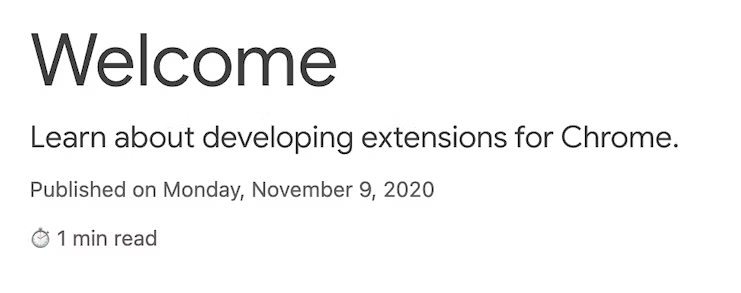
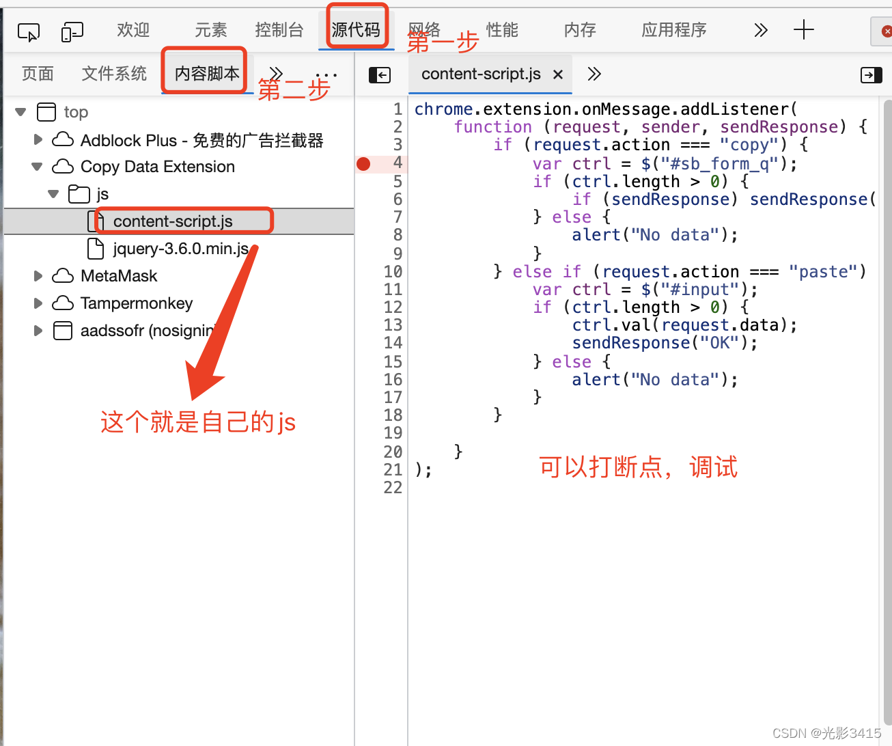

# content script

Extensions can run scripts that read and modify the content of a page. These are called content scripts. They live in an isolated world, meaning they can make changes to their JavaScript environment ==without conflicting with their host page or other extensions' content scripts.==

###  manifest

```
{
  ...
  "content_scripts": [
    {
      "js": ["scripts/content.js"],
      "matches": [
        "https://developer.chrome.com/docs/extensions/*",
        "https://developer.chrome.com/docs/webstore/*"
      ]
    }
  ]
}
```

The "matches" field can have one or more match patterns. These allow the browser to identify which sites to inject the content scripts into. Match patterns consist of three parts <scheme>://<host><path>. They can contain '*' characters.

# 代码

功能： adds the expected reading time to any Chrome extension and Chrome Web Store documentation page.

### manifest

```json
{
    "manifest_version": 3,
    "name": "Reading time",
    "version": "1.0",
    "description": "Add the reading time to Chrome Extension documentation articles",
    "content_scripts": [
        {
          "js": ["scripts/content.js"],
          "matches": [
            "https://developer.chrome.com/docs/extensions/*",
            "https://developer.chrome.com/docs/webstore/*"
          ]
        }
      ]
}
```

### script(content.js)

Content scripts can use the standard Document Object Model (DOM) to read and change the content of a page. The extension will first check if the page contains the article element. Then, it will count all the words within this element and create a paragraph that displays the total reading time.

```js
const article = document.querySelector("article");

// `document.querySelector` may return null if the selector doesn't match anything.
if (article) {
  const text = article.textContent;
  const wordMatchRegExp = /[^\s]+/g; // Regular expression
  const words = text.matchAll(wordMatchRegExp);
  // matchAll returns an iterator, convert to array to get word count
  const wordCount = [...words].length;
  const readingTime = Math.round(wordCount / 200);
  const badge = document.createElement("p");
  // Use the same styling as the publish information in an article's header
  badge.classList.add("color-secondary-text", "type--caption");
  badge.textContent = `⏱️ ${readingTime} min read`;

  // Support for API reference docs
  const heading = article.querySelector("h1");
  // Support for article docs with date
  const date = article.querySelector("time")?.parentNode;

  (date ?? heading).insertAdjacentElement("afterend", badge);
}
```

 Interesting JavaScript used in this code
 
 - Nullish coalescing returns the <heading> if the <date> is null or undefined.
 
# 效果



# 调试方法

