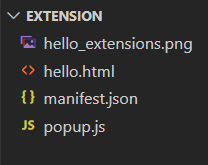
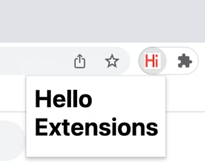
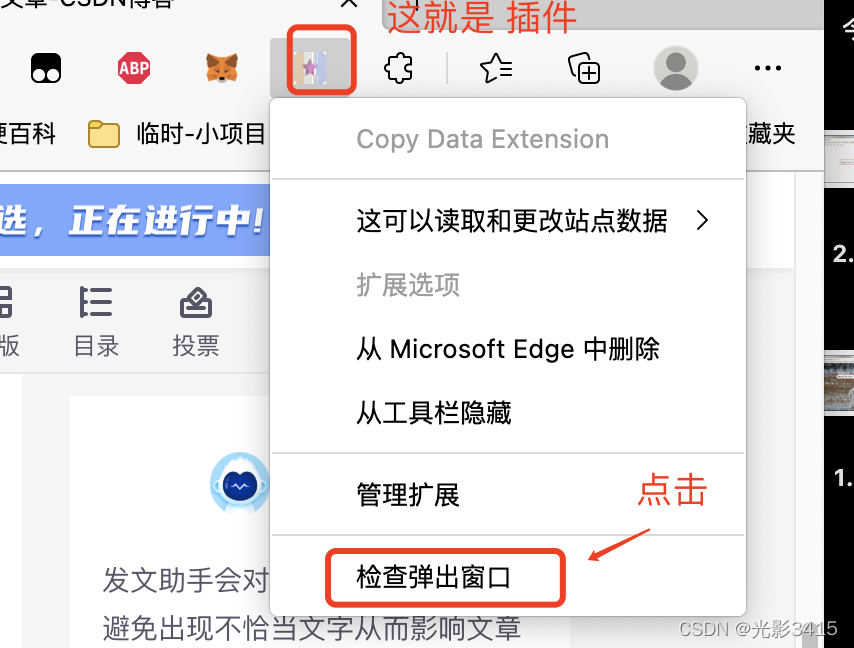
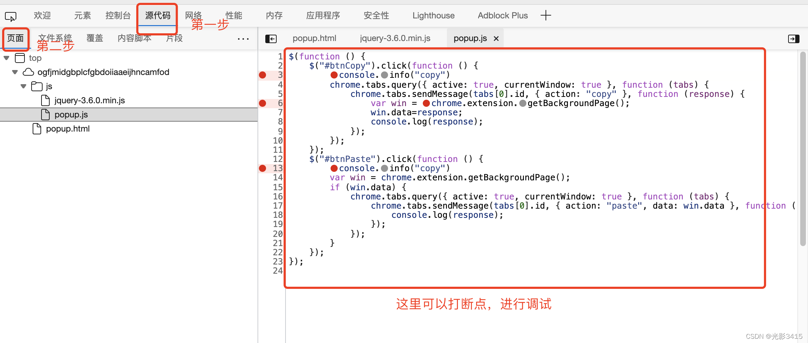

# 一个简单的项目

==注意： manifest.json文件必须放在项目根目录下==

### 结构



### manifest.json文件

```
{
  "manifest_version": 3,
  "name": "Hello Extensions of the world",
  "description": "Base Level Extension",
  "version": "1.0",
  "action": {
    "default_popup": "hello.html",
    "default_icon": "hello_extensions.png"
  }
}
```


### hello.html

```
<html>
  <body>
    <h1>Hello Extensions</h1>
    <script src="popup.js"></script>
  </body>
</html>
```

### popup.js

```
console.log("This is a popup!A")
```


# 效果



# 调试方法



