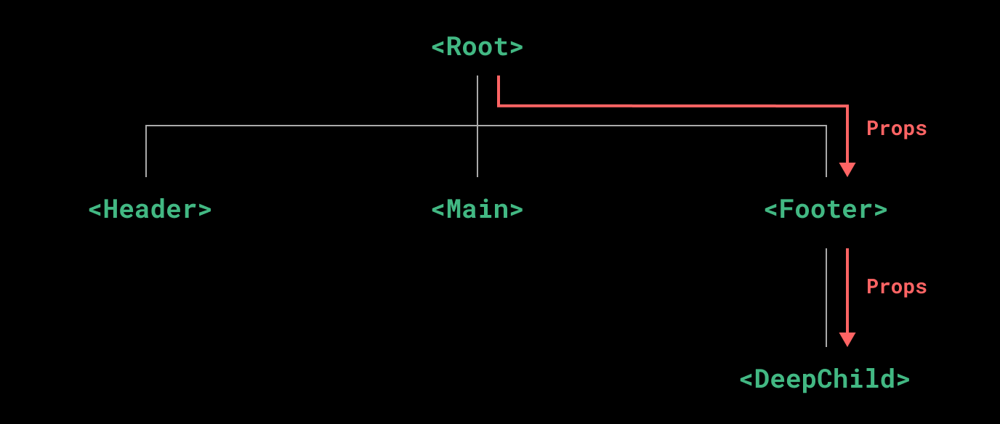

# 依赖注入

通常情况下，当我们需要从父组件向子组件传递数据时，会使用 props。想象一下这样的结构：有一些多层级嵌套的组件，形成了一颗巨大的组件树，而某个深层的子组件需要一个较远的祖先组件中的部分数据。在这种情况下，如果仅使用 props 则必须将其沿着组件链逐级传递下去，这会非常麻烦：



注意，虽然这里的 <Footer> 组件可能根本不关心这些 props，但为了使 <DeepChild> 能访问到它们，仍然需要定义并向下传递。如果组件链路非常长，可能会影响到更多这条路上的组件。这一问题被称为“prop 逐级透传”，显然是我们希望尽量避免的情况。

provide 和 inject 可以帮助我们解决这一问题。 [1] 一个父组件相对于其所有的后代组件，会作为依赖提供者。任何后代的组件树，无论层级有多深，都可以注入由父组件提供给整条链路的依赖。

### Provide (提供)

要为组件后代提供数据，需要使用到 provide() 函数：

```html
<script setup>
import { provide } from 'vue'

provide(/* 注入名 */ 'message', /* 值 */ 'hello!')
</script>
```

provide() 函数接收两个参数。第一个参数被称为注入名，可以是一个字符串或是一个 Symbol。后代组件会用注入名来查找期望注入的值。一个组件可以多次调用 provide()，使用不同的注入名，注入不同的依赖值。

第二个参数是提供的值，值可以是任意类型，包括响应式的状态，

```js
import { ref, provide } from 'vue'

const count = ref(0)
provide('key', count)
```

### Inject (注入)

要注入上层组件提供的数据，需使用 inject() 函数：

```js
<script setup>
import { inject } from 'vue'

const message = inject('message')
</script>
```