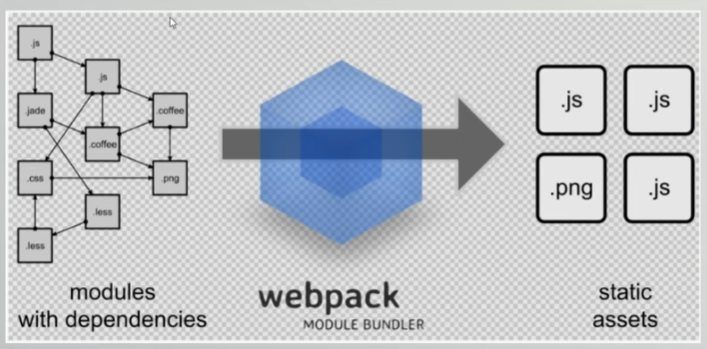

# NPM包管理器

npm：node package manager，node包管理器

作用：

- 快速构建nodejs工程（npm init -y）
- 快速安装和依赖第三个模块。比如npm install mysql等

### 配置镜像

查看当前使用的镜像地址命令

```
npm config get registry
```

切换为淘宝镜像命令（安装一些package容易报错）

```
npm config set registry https://registry.npm.taobao.org
```

### 有用的命令

- npm exec ${programe_name} ：npm exec命令是用来从本地或远程npm包中运行命令的。可用于执行项目目录下node_modules文件下的命令
- npm update：更新当前工程下的依赖

# Babel

Babel是一个广泛使用的转码器，可以将ES6代码转为ES5代码，从而在现有环境执行。

这意味着，你可以现在用ES6编写程序，而不用担心现有环境是否支持

### 安装

```
npm install -g babel-cli
```

### Babel的使用

- 1.创建babel文件

- 2.初始化项目

```
npm init -y
```

- 3.创建文件src/example.js:

```js
let name="hanhan"
const age = 20;

let arr = [1,2,3,4,5,6]

let newarr = arr.filter(element=>element%2==0)

console.log(`name:${name} , age:${age}`);

console.log(newarr)
```

- 4.配置.babelrc文件

Babel的配置文件是babelrc，存放在项目的根目录下，改文件用来设置转码规则和插件，基本格式如下：

```js
{
    "presets": [],
    "plugins": []
}
```

presets字段设定转码规则，将es2015规则加入.babelrc：

```js
{
    "presets": ["es2015"],
    "plugins": []
}
```

- 5.安装转码器

```
npm install babel-preset-es2015
```

- 6.转码

```
babel .\src\ -d .\dist\
```

# Webpack

Webpack是一个前端资源加载/打包工具，它根据模块的依赖关系进行静态分析，然后将这些模块按照指定的规则生成对应的静态资源。

Webpack可以将多种静态资源js、css、less转换成一个静态文件，减少页面的请求



### 安装

```
npm install -g webpack webpack-cli
```

### 使用

- 1.创建一个nodejs 项目

```
npm init -y
```

- 2.创建一个src目录
- 3.在src存放两个需要合并的util.js和common.js

util.js:

```js
add = function(a,b){
    return a+b;
};

module.exports = {
    add
}
```

common.js

```js
info = function(str){
    console.log(str);
    document.write(str);
};

module.exports = {
    info
}
```

- 4.准备一个入口文件main.js，其实就是模块集中进行引用


main.js

```js
const util = require('./util');
const common = require('./common');


common.info("helloworld:" + util.add(100,200));
```

- 5.在项目根目录下定义个webpack.config.js文件配置打包规则

```js
//导入path模块，nodejs内置模块
const path = require("path");

//定义js打包的规则
module.exports = {
    //定义入口文件，指定从哪里开始进行编译打包
    entry:"./src/main.js",
    //编译成功后文件输出的位置
    output:{
        //__dirname:当前项目的目录
        path:path.resolve(__dirname,"./dist"),
        filename:"bundle.js"
    }
}
```

- 6.执行webpack，查看效果

```
webpack
```

### 有用的webpack选项

```
 -w, --watch                            Enter watch mode, which rebuilds on file change.
```

# Parcel

Parcel很聪明，因为它可以监视对依赖项调用的代码内容，并自动安装它看到的代码需要的任何依赖项。它还可以自动构建我们的代码，并启用服务

### 安装

```
npm install parcel-bundler
```

### 运行

```
npm exec parcel index.html
```

output:

```
Server running at http://localhost:1234
✨  Built in 193ms.
```

# ESLint

ESLint有助于提高代码质量，同时也是在开发过程中尽早捕获潜在错误的一种方法

# axios

用于对服务的发起http请求的库

### 资料

https://www.axios-http.cn/

# mock

用于模拟服务端请求

# js-cookie

cookie  管理

### 资料 

http://mockjs.com/