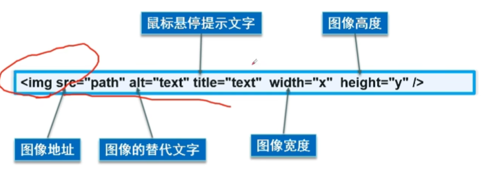
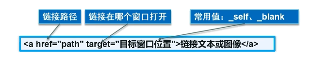
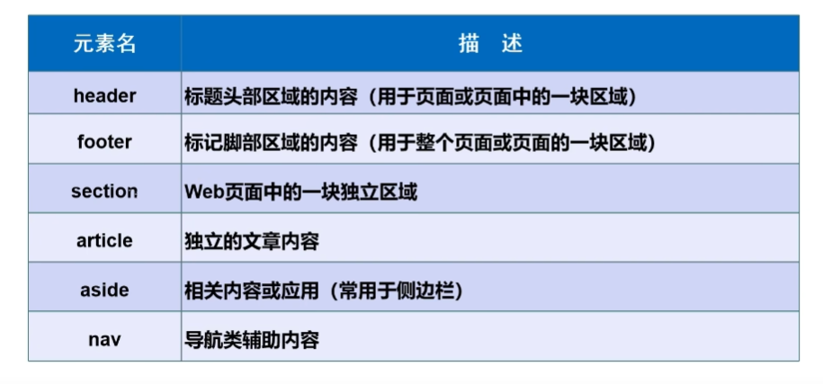
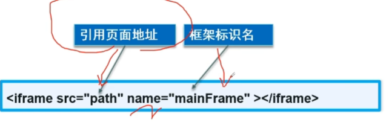
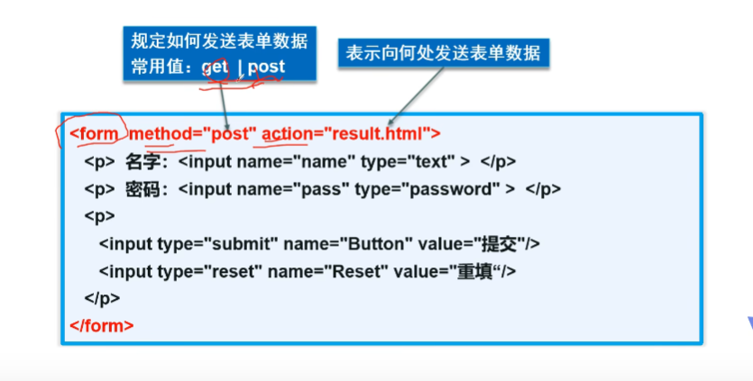
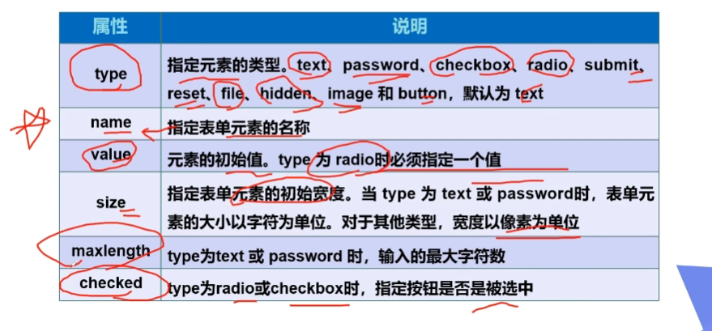

# 基本结构

```html
<!DOCTYPE html>
<html lang="en">
<head>
    <meta charset="UTF-8">
    <meta http-equiv="X-UA-Compatible" content="IE=edge">
    <meta name="viewport" content="width=s, initial-scale=1.0">
    <title>Document</title>
</head>
<body>
    
</body>
</html>
```

# 网页基本标签

```html
<!--- 标题标签 --->
<h1>一级标签</h1>
<h2>二级标签</h2>

<!--段落标签-->
<p>第一段落</p>
<p>第二段落</p>

<!--换号标签-->
换行<br>
换行<br>

<!---水平线标签-->
<hr>

<!---粗体、斜体标签-->
<strong>粗体: hanhan</strong>
<em>协议: hanhan</em>

<!--特殊符号-->
<br>
空&nbsp;&nbsp;&nbsp;&nbsp;&nbsp;&nbsp;格<br>
&gt;<br>
&lt;<br>
&copy;
```

# 图像标签



# 超链接



    <!---target="_blank" 在新标签中打开-->
    <a href="http://www.baidu.com" target="_blank">跳转到百度</a>

    <!---target="_self" 在自己标签中打开-->
    <a href="http://www.baidu.com" target="_self">跳转到百度</a>

### 锚点

先创建锚点

    <a id="top"></a>

然后可以跳转到锚点的所在位置

    <a href="#top">回到顶部</a>

### 邮件连接

    <a href="mailto:312225644@qq.com">联系我</a>

# 行内元素和块元素

块元素：无论内容多少，该元素独占一行

行内元素：内容撑开宽度，左右都是行内元素的可以在排在一行

# 列表标签

### 有序列表

    <ol>
        <li>Linux</li>
        <li>C</li>
        <li>C++</li>
    </ol>

### 无序列表

    <ul>
        <li>Linux</li>
        <li>C</li>
        <li>C++</li>
    </ul>

### 自定义列表

    <!--
    dl：标签
    dt：列表名称
    dd：列表内容

    应用范围：公司网站底部
    -->
    <dl>
        <dt>CS</dt>
        <dd>C</dd>
        <dd>C++</dd>
        <dd>Linux</dd>
    </dl>

# 表格

    <!---
    行:<tr>
    列:<td>
    --->
    <table border="1px">
        <tr>
            <!--colspan 跨列-->
            <td colspan="3">1-1</td>
        </tr>

        <tr>
            <!--colspan 跨行-->
            <td rowspan="2">2-1</td>
            <td>2-2</td>
            <td>2-3</td>
        </tr>

        <tr>
            <td>3-1</td>
            <td>3-2</td>
        </tr>
    </table>

# 视频和音频

    <!--
    src:资源路径
    controls：控制条
    autoplay：自动播放
    -->
    <video src="..." controls autoplay></video>


    <audio src="..." controls autoplay> </audio>

# 页面结构分析



# iframe内联框架



# 表单

### 初识表单



    <!--
    action:表单提交的位置，可以是网站，也可以是一个请求处理地址
    method:post、get 提交方式

    -->
    <form method="get" action=".">
        <p>名字：<input type="text" name="username"></p>
        <p>密码：<input type="password" name="pwd"></p>

        <p>
            <input type="submit">
            <input type="reset">
        </p>
    </form>

### input元素属性



### 单选框

    <!--单选框标签
        type="radio"
        value:单选框的值
        name：表示组，组不一样可以同时选中，所以单选框必须保证组相同
    -->
    <p>性别: <input type="radio" value="boy" name="sex">男
            <input type="radio" value="girl" name="sex">女
    </p>

### 多选框

    <!--多选框
        type="checkbox"
    -->
    <p>爱好：<input type="checkbox" value="sleep" name="hobby">睡觉
            <input type="checkbox" value="code" name="hobby">代码
            <input type="checkbox" value="cheat" name="hobby">聊天

    </p>

### 按钮

    <p>
        <input type="button" name="btn" value="click me">
    </p>

    <p>
        <input type="submit">
        <input type="reset">
    </p>

### 下拉框

    <p>国家：
        <select name="country">
            <option value="China">中国</option>
            <option value="American" selected>美国</option>
            <option value="India">印度</option>
            <option value="Japan">日本</option>
        </select>
    </p>

### 文本域

    <p>反馈：
        <textarea name="textarea" cols="20" rows="10"></textarea>
    </p>

### 文件域

    <p>
        <input type="file" name="files">
    </p>

### 滑块

    </p>音量：
    <input type="range" min="0" max="100" name="voice" step="2">
    <p>

    <p>搜索：
    <input type="search" name="search">
    </p>

### 表单的一些属性

readonly:只读

    <p>名字：<input type="text" name="username" placeholder="用户名" readonly></p>

disabled：禁用

hidden：隐藏

### 增强鼠标可用性

    <p>
        <label for="click_me">点我试试</label>
        <input type="text" id="click_me">
    </p>

### 表单初级验证

placeholder：提示信息

    <p>名字：<input type="text" name="username" placeholder="用户名"></p>

required：表示该input不能为空

pattern：正则表达式匹配input标签

    <p>邮箱：
        <input type="text" name="mail" pattern="^[a-zA-Z0-9_-]+@[a-zA-Z0-9_-]+(.[a-zA-Z0-9_-]+)+$">
    </p>

