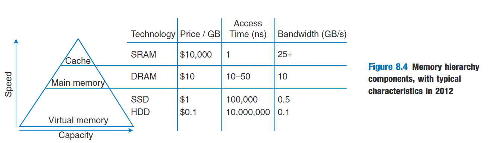
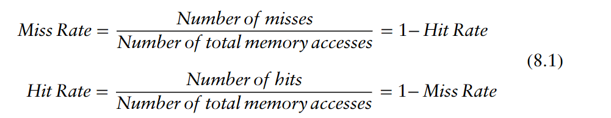
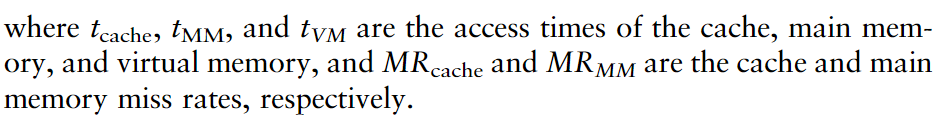
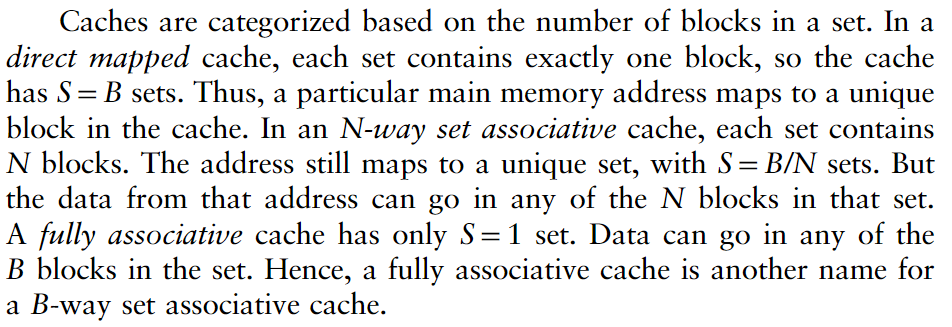
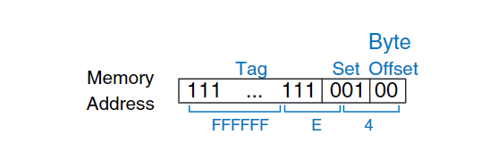
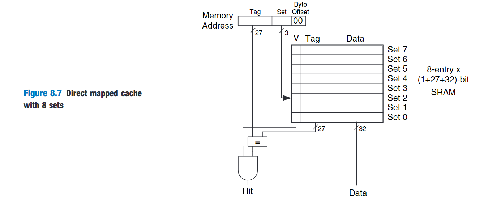
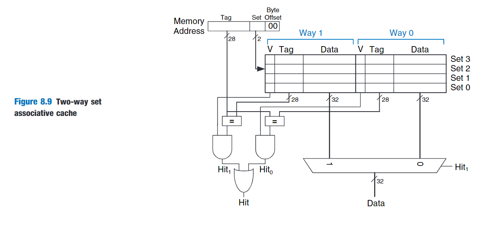
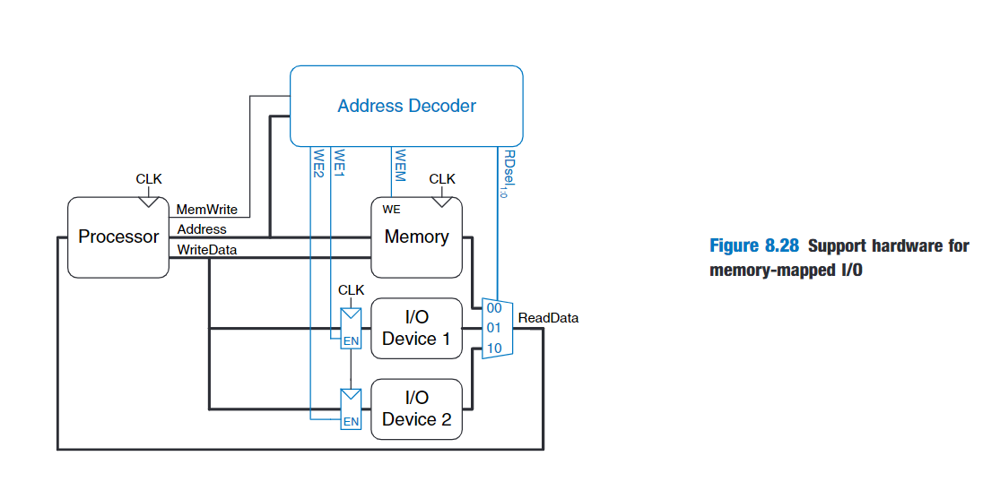

Computer system performance depends on the memory system as well as the processor microarchitecture.

# Memory System Performance Analysis

Average memory access time(AMAT) is the average time a processor must wait for memory per load or store instruction.In the typical computer system,the processor first looks for the data in the cache.If the cache misses,the processor then looks in main memory.If the main memory misses,the processor accesses virtual memory on the hard disk.

# Caches

When the processor attempts to access data,it first checks the cache for the data.If the cache hits,the data is available immediately.If the cache misses,the processor fetches the data from main memory and places it in the cache for future use.

Caches are categorized based on the number of blocks in a set.

### direct mapped cache

### Multi-way Set Associative Cache

### Putting it All Together

Caches are organized as two-dimensional arrays.The rows are called sets,and the columns are called ways.Each entry in the array consists of a data block and its associated valid and tag bits.Caches are characterized by:

- capacity C
- block size b
- number of blocks in a set

Each address in memory maps to only one set but can be stored in any of the ways.

Increasing the associativity N usually reduces the miss rate caused by conflicts.But higher associativity requires more tag comparators.Increasing the block size b take advantage of spatial locality to reduce the miss rate.However,it decrease the number of sets in a fixed sized cache and therefore could lead to more conflicts.It also increases the miss penalty.

- compulsory misses
- capacity misses
- conflict misses

# IO Introduction

A processor accesses an IO device using the address and data busses in the same way that it accesses memory.

An address decoder determines which device communicates with the processor.It uses the Address and MemWrite signals to generate control singals for the reset of the hardware.The ReadData multiplexer selects between memory and the various IO devices.Write-enabled registers hold the values written to the IO devices.

# PC IO Systems