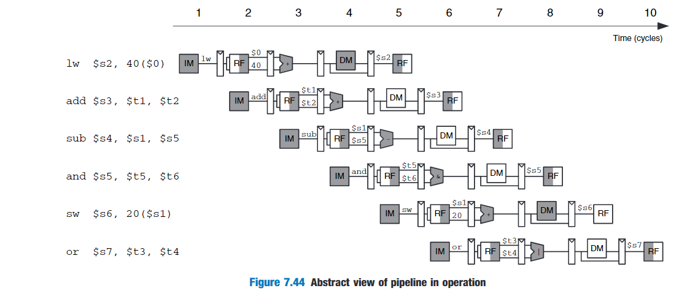

We design a pipelined processor by subdividing the single-cycle processor into five pipeline stages.

Reading and writing the memory and register file and using the ALU typically constitute(构成) the biggest delays in the processor.We choose five pipeline stages so that each stage involves exactly one of these slow steps.Specifically,we call the five stages Fetch,decode,execute,memory and writeback.

- Fetch:reads the instruction from instruction memory.
- Decode:reads the source operands from the register file and decodes the instruction to produce the control signals.
- Execute:performs a computation with the ALU.
- Memory:reads or writes data memory.
- writeback:writes the result to the register file.

In the pipelined processor,the register file is written in the first part of a cycle and read in the second part,as suggested by the shading.This way,data can be written and read back within a single cycle.

# Pipelined Datapath

The pipelined datapath is formed by chopping(砍) the single-cycle datapath into five stages separated by pipeline registers.

# Pipelined Control

The pipelined processor takes the same control signals as the single-cycle processor and therefore uses the same control unit.These control signals must be pipelined along with the data so that they remain synchronized with the instruction.

# Hazards

In a pipelined system,multiple instructions are handled concurrently.When one instruction is dependent on the results of another that has not yet completed,a hazard occurs.

Hazards are classified as data hazards or control hazards.A data hazard occurs when an instruction tries to read a register that has not yet been written back by a previous instruction.A control hazard occurs when the decision of what instruction to fetch next has not been made by the time the fetch takes place.

### Solving Data Hazards with forwarding

This requires adding multiplexers in front of the ALU to select the operand from either the register file or the Memory or Writeback stage.

If both the Memory and Writeback stages contain matching destination registers,the memory stage should have priority,because it contains the more recently executed instruction.

### Solving Data Hazards with Stalls

The hazard unit examines the instruction in the Execute stage.If it is lw and its destination register(rtE) matches either source operand of the instruction in the Decode stage(rsD or rtD),that instruction must be stalled in the Decode stage unitl the source operand is ready.

Stalls are supported by adding enable inputs(EN) to the Fetch and Decode pipeline registers and a synchronous reset/clear(CLR) input to the Execute pipeline register.When a lw stall occurs,StallD and StallF are asserted to force the Decode and Fetch stage pipeline registers to hold their old values.FlushE is also asserted to clear the contents of the Execute stage pipeline register,introducing a bubble.

### Solving Control Hazards

Moving the decision as early as possible minimizes the number of instructions that are flushed on a misprediction.

One of designing a pipelined processor is to understand all the possible interactions between instructions and to discover all the hazards that may exist.

# 资料

MIPS流水线CPU的verilog实现

https://wenku.baidu.com/view/c9f71522ed630b1c59eeb52e.html#