# Single-Cycle Datapath

lw instruction:

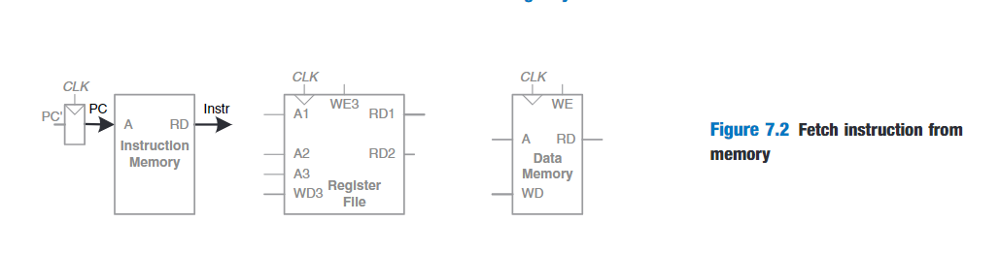

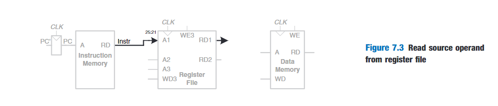

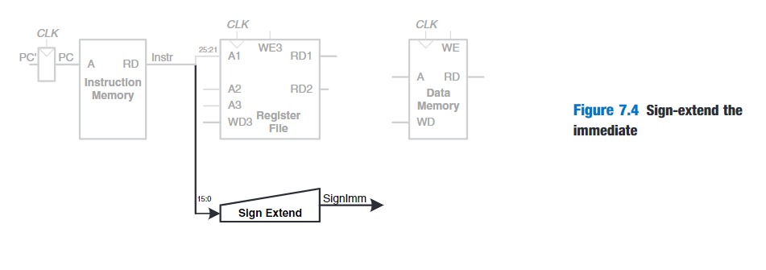

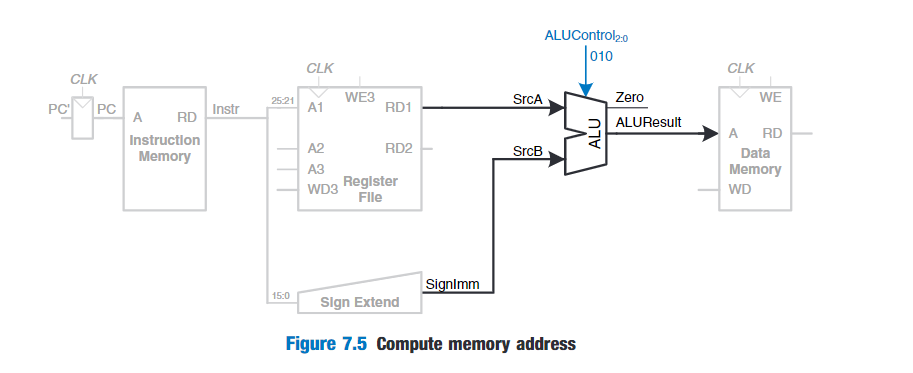

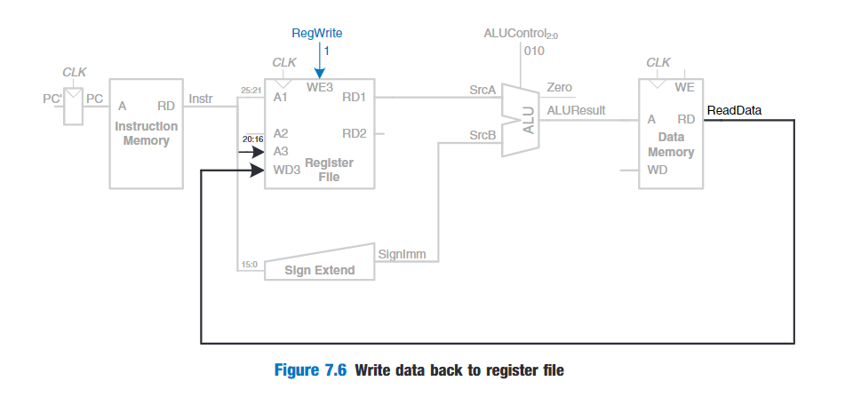

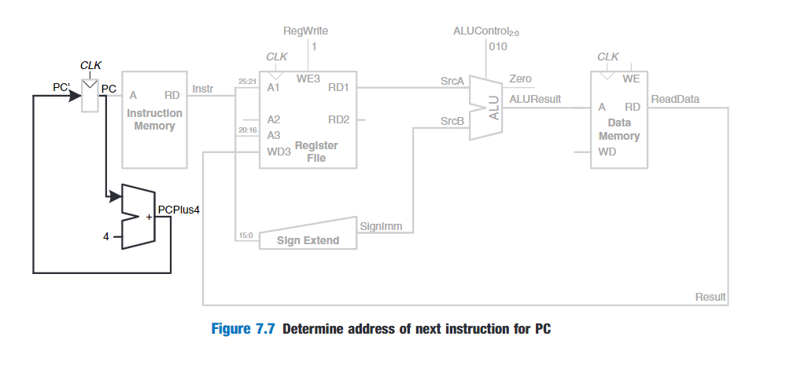

sw instruction:

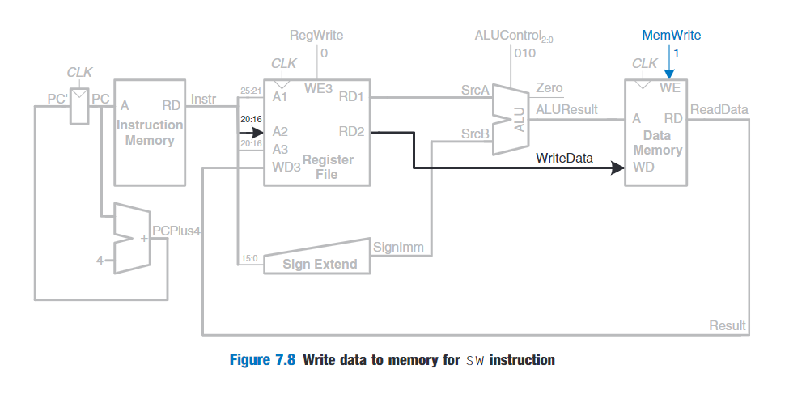

R-type instruction:

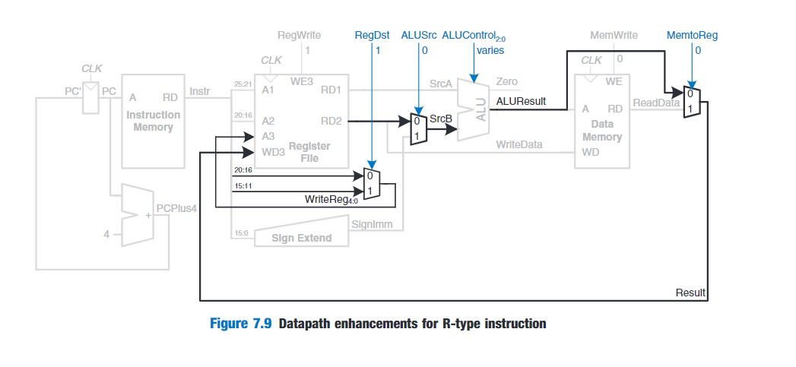

beq instruction:

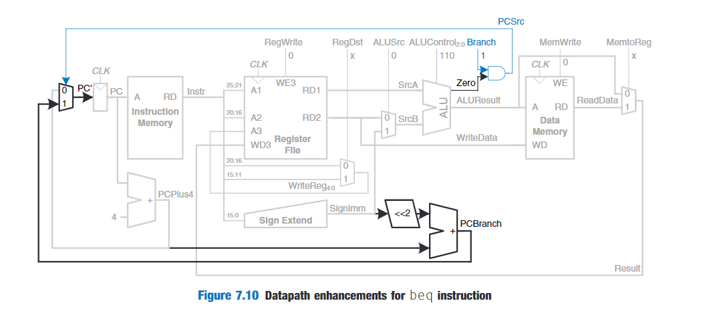

# Single-Cycle Control

The control unit computes the control signals based on the opcode and funct fields of the instruction.

Most of the control information comes from the opcode,but R-type instructions also use the funct field to determine the ALU operation.Thus,we will simplify our design by factoring the control unit into two blocks of combinational logic.The main decoder computes most of the outputs from the opcode.It also determines a 2-bit ALUOp signal.The ALU decoder uses this ALUOp signal in conjunction with the funct field to compute ALUControl.

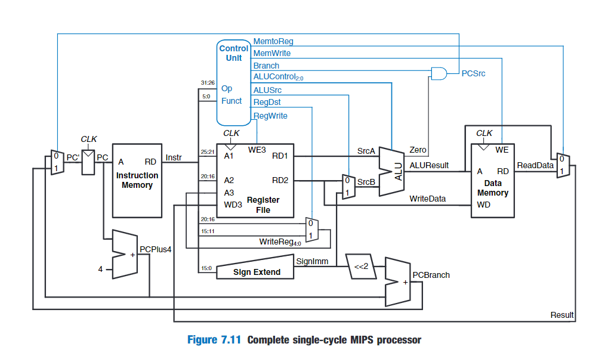

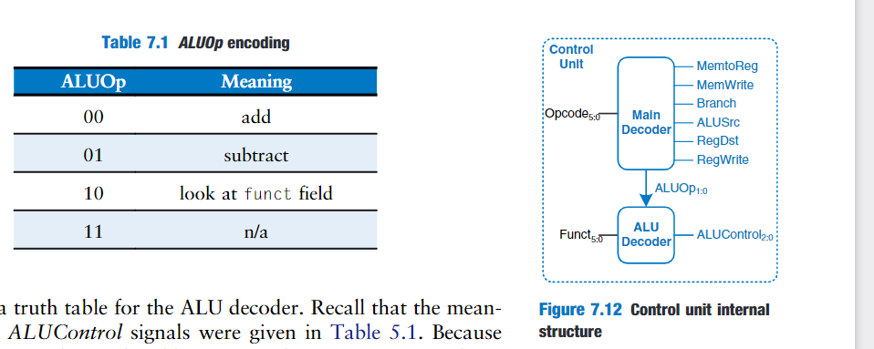

.jpg)

.jpg)

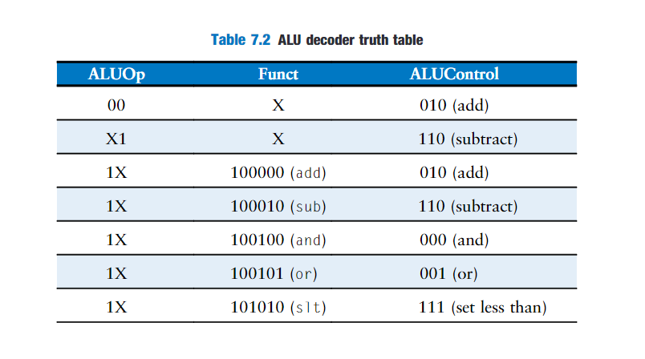

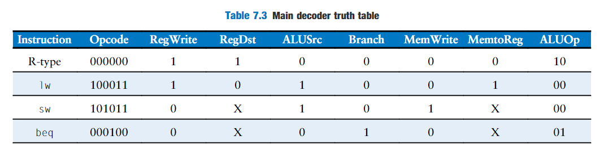

# Performance Analysis

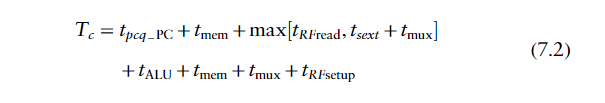

# 资料

MIPS 指令集速查

https://www.cnblogs.com/mipscpu/archive/2013/03/22/2976316.html