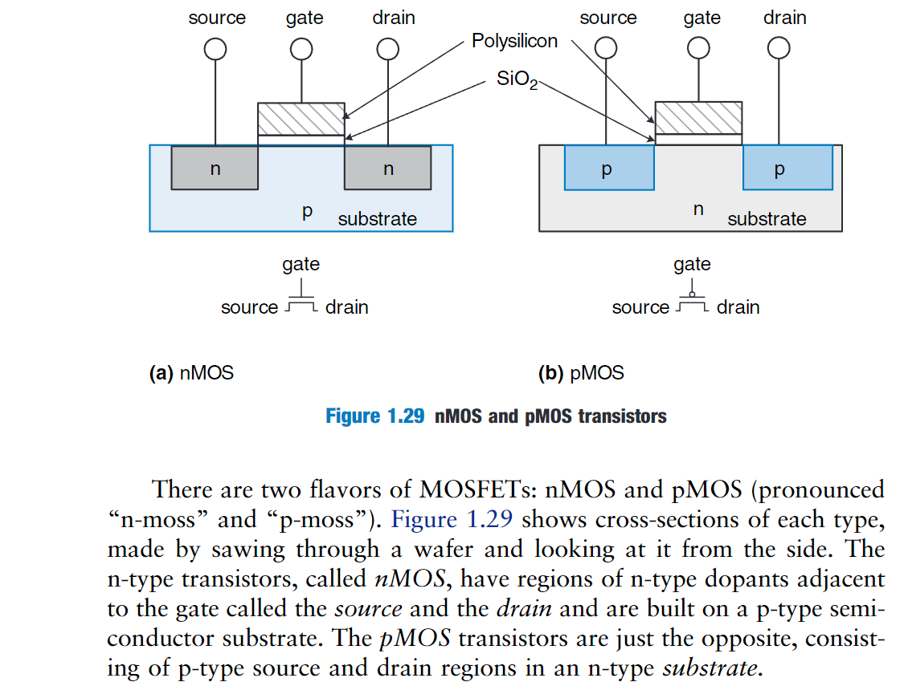
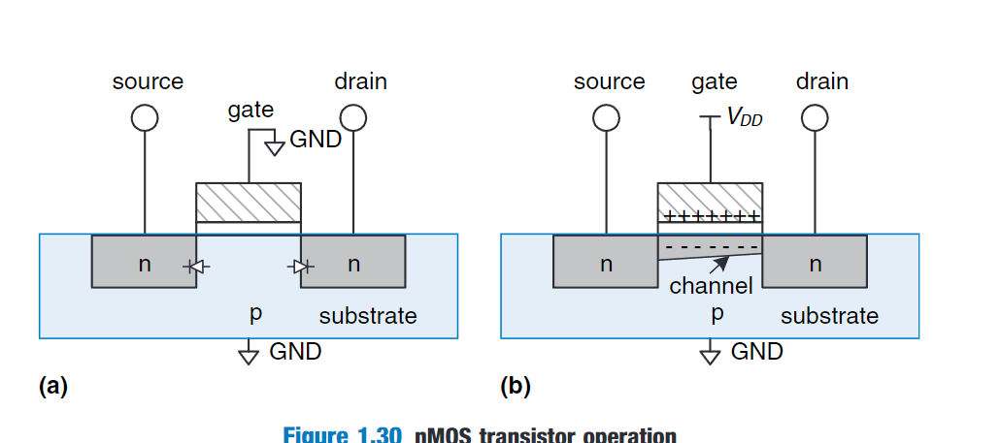
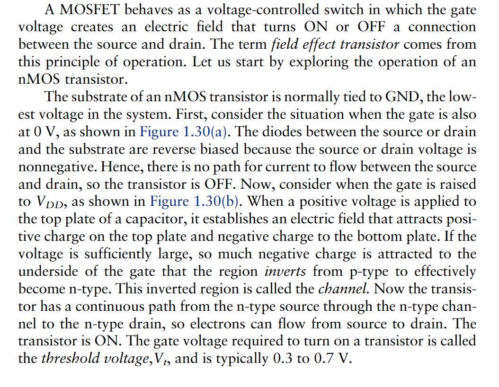
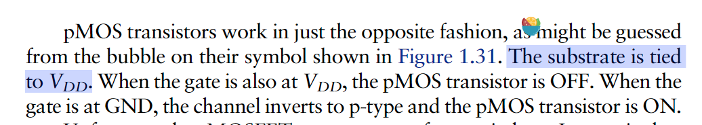
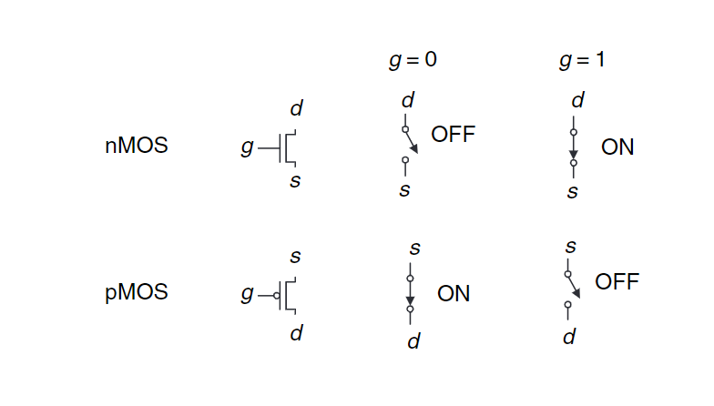
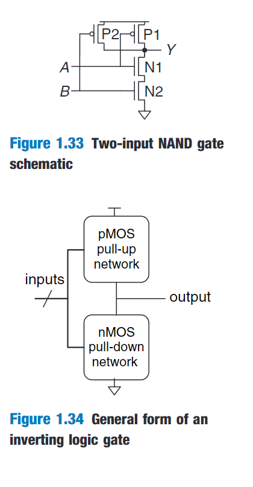
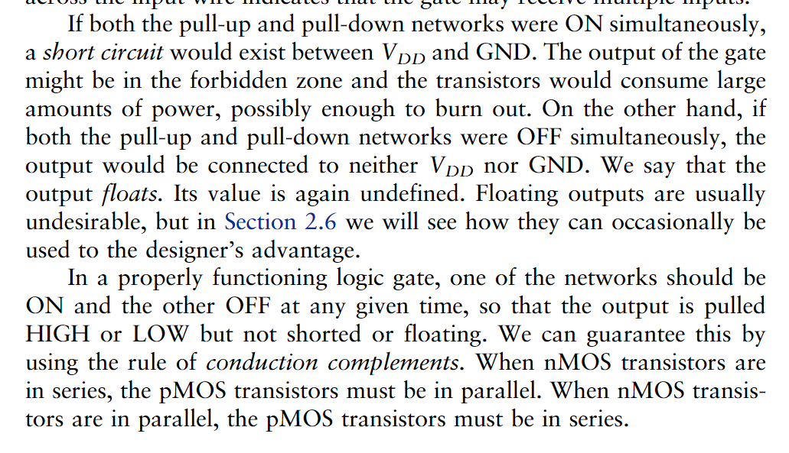

A great advantage of digital systems is that the building blocks are quite simple:just 1's and 0's.They do not require grungy mathematics or a profound knowledge of physics.

# 管理复杂性

### 抽象

把不重要的细节隐藏起来。(hiding details when they are not important)

微体系结构链接了抽象的逻辑和体系结构级别(Microarchitecture links the logic and architecture levels of abstraction)。

微体系结构设计组合逻辑单元，执行体系结构定义的指令(Microarchitecture involves combining logic elements to execute the instructions defined by the architecture)

.png)

# 纪律、约束(Discipline)

约束是一种有意限制你的选择的一种行为，以方便你能够在更高的抽象水平上更高效的工作(Discipline is the act of intentionally restricting your design choices so that you can work more productively at a higher level of abstraction)。

# The Three-Y's

除了抽象和约束外，设计者会使用三个'-y's'来管理复杂性：

- hierarchy：层次(A system diviede into modules and submodules)
- modularity：模块(Having well-defined functions and interfaces)
- regularity：规则(Encouraging uniformity,so modules can be easily reused)

# THE DIGITAL ABSTRACTION

数字系统使用离散的值来表示信息

The beauty of the digital abstraction is that digital designers can focus on 1's and 0's,ignoring whether the Boolean variables are physically represented with specific voltages,and so on.

# 逻辑门

AND OR XOR

# 开始数字抽象

### Noise Margins(噪声容限)

.png)

# CMOS

 

