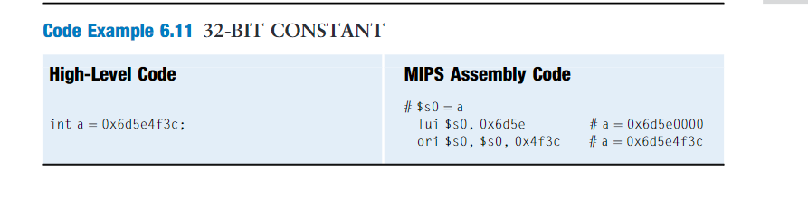
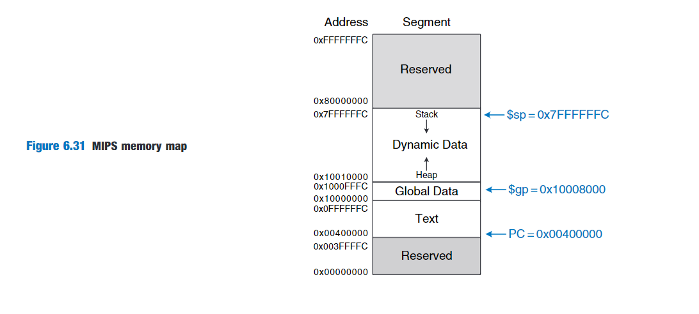

- simplicity favors regularity
- make the common case fast
- smaller is faster
- good design demands good compromises.

# ASSEMBLY LANGUAGE

MIPS register names are preceded by the $ sign.

MIPS generally stores variables in 18 of the 32 registers:$s0-$s7,and $t0-$t9.Register names beginning with $s are called saved reigsters,Register names beginning with $t are called temporary registers.

.png)

The MIPS instruction set make the compromise(折中) of supporting three instruction formats.One format,used for instructions such as add and sub,has three register operands.Another,used for instructions such as lw and addi,has two register operands and a 16-bit immediate.A third,has a 26-bit immediate and no registers.

# MACHINE LANGUAGE

R-type instructions operate on three registers.

I-type instructions operate on two registers and a 16-bit immediate

J-type(jump) instructions operate on one 26-bit immediate.

### R-Type Instructions

.png)

All R-type instructions have an opcode of 0.The specific R-type operation is determined by the funct field.

rs and rt,are the source registers;rd is the destination register.

shamt:is used only in shift operations,In those instructions,the binary value stored in the 5-bit shamt field indicates the amount to shift.

.png)

### I-type Instructions

The name I-type is short for immediate-type.

.png)

rs and imm are always used as source operands.rt is used as a destination.

.png)

### J-type Instructions

The name J-type is short for jump-type.This format is used only with jump instructions.

.png)

### Interpreting Machine Language Code 

opcode.If it is 0,the instruction is R-type;otherwise it is I-type or J-type.

### The Power of the Stored Program

architectural state

fetch --> decode --> execute

# PROGARMMING

### Arithmetic/Logical Instructions

To assign 32-bit constants,use a load upper immediate instruction(lui) followed by an or immediate instruction(orl).lui loads a 16-bit immediate into the upper half of a register and sets the lower half to 0.As mentioned earlier,ori merges a 16-bit immediate into the lower half.

### Branching

An advantage of a computer over a calculator is its ability to make decisions.

##### Conditional Branches

beq，bne

beq rs,rt,imm , where rs is the first source register.This order is reversed from most I-type instruction

##### Jump

A program can unconditionally branch,or jump,using the three types of jump instructions:jump(j),jump and link(jal),and jump register(jr).Jump(j) jumps directly to the instruction at the specified label.Jump and link (jal) is similar to j but is used by functions to save a return address.

##### Magnitude Comparison

MIPS provides the set less than instruction,slt,for magnitude comparison.slt sets rd to 1 when rs < rt.Otherwise,rd is 0.

##### Array

.png)

##### Bytes and Characters

.png)

### Function Calls

In MIPS,the caller conventionally places up to four arguments in register $a0-$a3 before making the function call,and the callee places the return value in registers $v0-$v1 before finishing.

The caller stores the return address in $ra at the same time it jumps to the callee using the jump and link instruction.

##### Function Calls and Returns

MIPS uses the jump and link instruction to call a function and the jump register instruction to return from function.

jal performs two operations: it stores the address of the next instruction in the return address register($ra),and it jumps to the target instruction.

.png)

##### Preserved(保存、保留) Registers

MIPS divides registers into preserved and nonpreserved categories.

The Preserved registers include $s0-$s7(hence their name,saved).The nonpreserved registers include $t0-$t9(hence their name,temporary).

preserved-registers are also called callee(被调用方)-save,and nonpreserved registers are called caller(调用方)-save.

A function must save and restore any of the preserved reigsters that it wishes to use,but it can change the nonpreserved registers freely.

The processor calculates the JTA(jump target address) from the J-type instruction by appending two 0's and prepending the four most significant bits of PC+4 to the 26-bit address field(addr).

.png)

page 336:

# SUMMARY

The key questions to ask when approaching a new architecture are:

- What is the data word length
- What are the registers
- How is memory organized
- What are the instructions