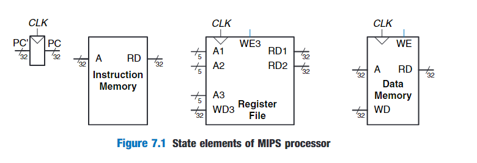
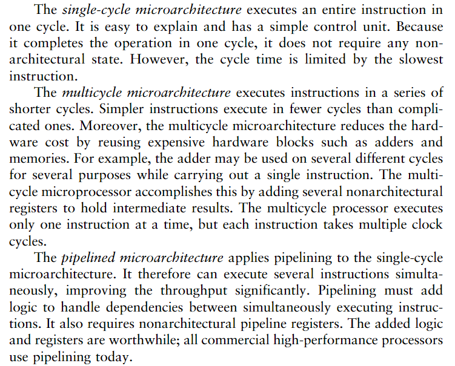
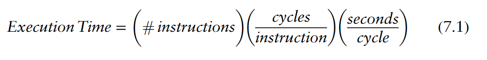

# Introduction

### Architecture State and Instruction Set

Recall that a computer architecture is defined by its instruction set and architectural state.The architectural state fro the MIPS processor consists of the program counter and the 32 registers.Based on the current architectural state,the processor executes a particular instruction with a particular set of data to produce a new architectural state.  

handle only the following instructions:

- R-type arithmetic/logic instructions:add,sub,and,or,slt
- Memory instructions:lw,sw
- Branches:beq

### Design Process

A good way to design a complex system is to start with hardware containing the state elements.These elements include the memories and the architecutral state(register file).Then,add block of combinational logic between the state elements to compute the new state based on the current state.

### MIPS Microarchitectures

# Performance Analysis

