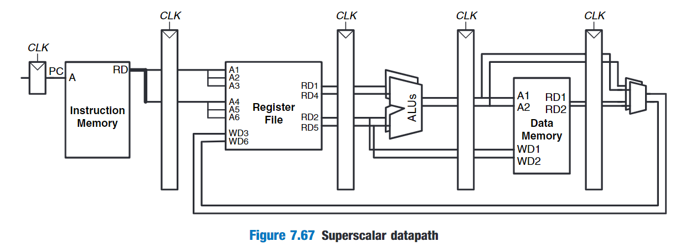
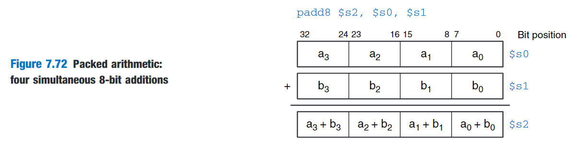

# Deep Pipelines

Aside from advances in manufacturing,the easiest way to speed up the clock is to chop the pipeline into more stages.Each stage contains less logic,so it can run faster.

The maximum  number of pipeline stages is limited by pipeline hazards,sequencing overhead,and cost.Longer pipelines introduce more dependencies.

Adding more stages increases the cost because of the extra pipeline registers and hardware required to handle hazards.

# Branch Prediction

The branch misprediction penalty is a major reason for increased CPI.As pipelines get deeper,branches are resolved later in the pipeline.Thus,the branch misprediction penalty gets larger,because all the instructions issued after the mispredicted branch must be flushed.

static branch prediction

dynamic branch predictors

branch target buffer:includes the destination of the branch and a history of whether the branch was taken.

one-bit dynamic branch predictor

# Superscalar Processor

A superscalar processor contains multiple copies of the datapath hardware to  execute multiple instructions simultaneously.

# Out-of-Order Processor

To cope with the problem of dependencies,an out-of-order processor looks ahead across many instructions to issue,or begin executing,independent instruction as rapidly as possible.

The instructions can be issued in a different order than that written by the programmer,as long as dependencies are honored so that the program produces the intended result.

- read after write(RAW) hazard
- write after read(WAR) hazard
- write after write(WAW) hazard

# Register Renaming

Out-of-order processors use a technique called register renaming to eliminate WAR hazards.

# Single Instruction Multiple Data(SIMD)

A common application of SIMD is to perform many short arithmetic operations at once,especially for graphics processing.This is also called packed arithmetic.

# Multithreading

Multithreading is also relatively inexpensive to implement,because it replicates only the PC and register file,not the execution units and memories.

# 资料

Microarchitecture

https://www.computerhope.com/jargon/m/microarchitecture.htm