CentOS7安装VCS、Verdi、SCL

1.Linux下所需安装文件

链接：https://pan.baidu.com/s/16ZmBj6RbaU-hVp5BwPTiUA 提取码：u2o4

​ synopsysinstaller_v5.0

​ scl_v2018.06

​ vcs_mx_vO-2018.09-SP2

​ vcs_vO-2018.09-SP2

​ verdi-2018.9

2.Windows破解文件

​ scl_keygen_2030

3.安装installer

打开终端，进入synopsysinstaller_v5.0目录，运行.run文件，会生成setup.sh文件，运行setup.sh

./SynopsysInstaller_v5.0.run
./setup.sh

运行setup.sh提示缺少依赖库libXss.so.1

repoquery --nvr --whatprovides libXss.so.1
sudo yum install libXScrnSaver-1.2.2-6.1.el7

再次运行setup.sh

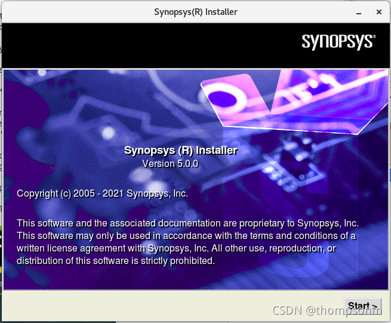

4.安装VCS等软件

Ubuntu需要将sh软连接到bash（默认链接到的是dash）

打开终端，进入home文件夹（/home），新建安装文件夹并设置权限

sudo mkdir synopsys
sudo chmod 777 synopsys

然后进去到installer文件夹，运行setup.sh，开始安装，下一步

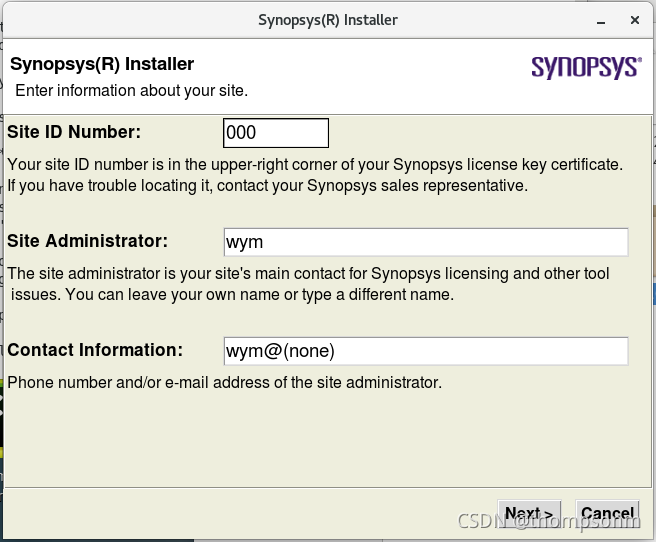

选择安装包路径

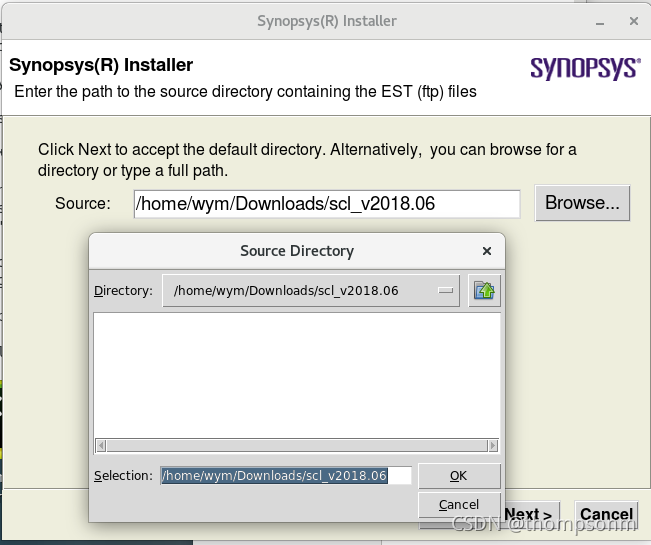

选择安装路径，指定到刚刚创建的安装文件夹

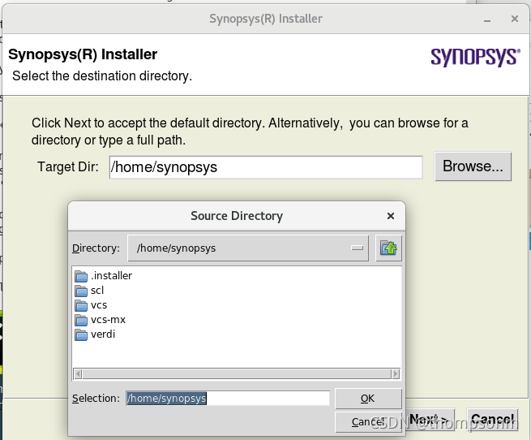

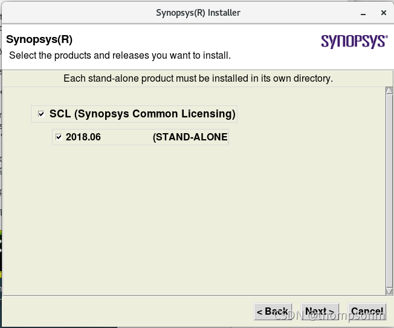

然后一路Next，最后Finish

其他软件按步骤依次安装

5.Windows下生成license

运行scl_keygen.exe

修改以下信息

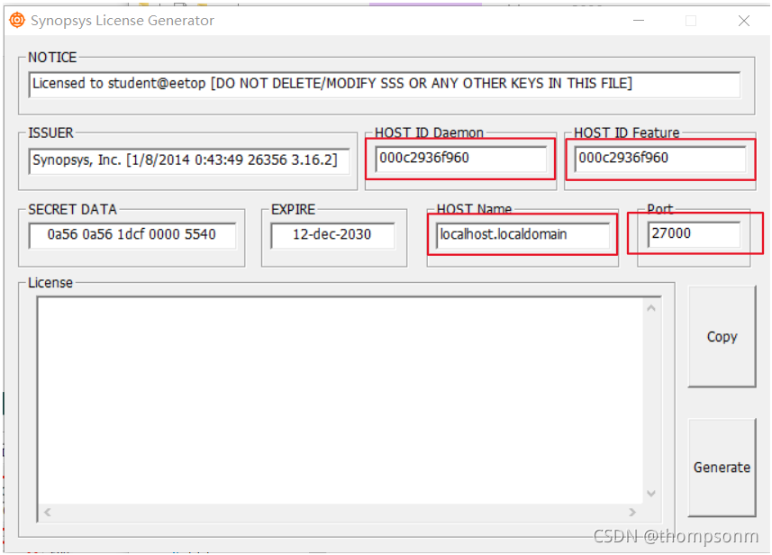

port设置为27000

进入Linux系统查看host name及host id

hostname
ifconfig

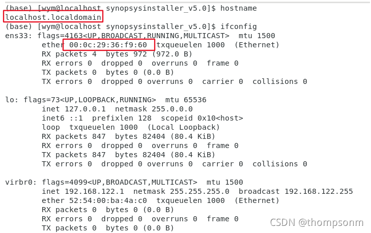

点击generate生成license

打开生成的license，也就是Synopsys.dat文件，修改第二行，需要与安装的scl路径一致

把license复制到scl/2018.06/admin/license/文件夹下

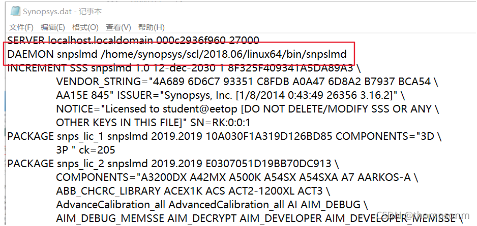

6.Linux下环境设置

打开用户文件夹下的.bashrc文件，添加以下内容，注意安装路径，且倒数第二行与hostname一致

export DVE_HOME=/home/synopsys/vcs/O-2018.09-SP2
export VCS_HOME=/home/synopsys/vcs/O-2018.09-SP2
export VCS_MX_HOME=/home/synopsys/vcs-mx/O-2018.09-SP2
export LD_LIBRARY_PATH=/home/synopsys/verdi/Verdi_O-2018.09-SP2/share/PLI/VCS/LINUX64
export VERDI_HOME=/home/synopsys/verdi/Verdi_O-2018.09-SP2
export SCL_HOME=/home/synopsys/scl/2018.06

#dve
PATH=$PATH:$VCS_HOME/gui/dve/bin
alias dve="dve"

#VCS
PATH=$PATH:$VCS_HOME/bin
alias vcs="vcs"

# alias vcs="vcs -full64 -cpp g++-4.8 -cc gcc-4.8 -LDFLAGS -Wl,--no-as-needed" #Ubuntu需要安装gcc-4.8与g++-4.8并启动这句 

#VERDI
PATH=$PATH:$VERDI_HOME/bin
alias verdi="verdi"

#scl
PATH=$PATH:$SCL_HOME/linux64/bin
export VCS_ARCH_OVERRIDE=linux

#LICENCE
export LM_LICENSE_FILE=27000@localhost.localdomain
alias lmg_synopsys="lmgrd -c /home/synopsys/scl/2018.06/admin/license/Synopsys.dat"

终端更新.bashrc

source .bashrc

7.激活

设置开放端口

firewall-cmd --zone=public --add-port=27000/tcp --permanent
firewall-cmd --reload

输入 lmg_synopsys 进行激活，若提示缺少依赖库，输入以下命令安装

yum install redhat-lsb.i686

Ubuntu：

sudo apt-get install lsb-core   #lsb-core
上述不可以时尝试使用
sudo apt-get install lsb-compat

激活好后输入“verdi”打开verdi工具，查看是否激活成功，但是这儿有是有错误，使用下面命令进行安装，成功后再输入“verdi”，能够打开verdi，激活成功

sudo yum install libpng12 -y

Ubuntu20用户：

sudo add-apt-repository ppa:linuxuprising/libpng12
sudo apt update
sudo apt install libpng12-0

Ubuntu高版本安装4.8版本的gcc与g++：

修改 /etc/apt/sources.list

添加

deb http://dk.archive.ubuntu.com/ubuntu/ xenial main

deb http://dk.archive.ubuntu.com/ubuntu/ xenial universe

即可

8.设置开机自动激活

进入到以下目录，切换到root打开rc.local文件

su

cd /etc/rc.d 

gvim rc.local

文件中添加以下代码

[lmgrd的路径] -c [Synopsys.dat的路径]exit 0

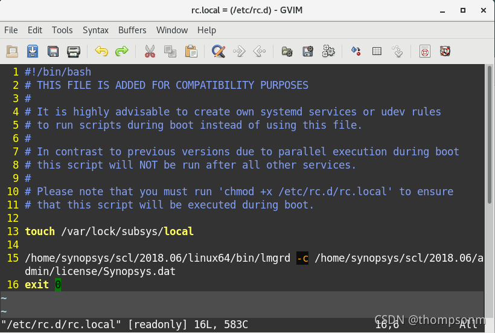

为rc.local添加可执行权限

chmod +x rc.local

设置完成！

9.测试

`timescale 1ns/1ns

module a(cout,sum,ina,inb,cin); 

output[3:0] sum; 

output cout; 

input[3:0] ina,inb; 

input cin; 

assign {cout,sum}=ina+inb+cin; 

endmodule

`timescale 1ns/1ns 

module tb_a; //测试模块的名字 

reg[3:0] a,b; //测试输入信号定义为reg型 

reg cin; 

wire[3:0] sum; //测试输出信号定义为 wire型 

wire cout; 

integer i,j; 

 

a adder(sum,cout,a,b,cin); //调用测试对象 

always #5 cin=~cin; //设定 cin的取值 

 

initial 

begin 

a=0;b=0;cin=0; 

for(i=1;i<16;i=i+1) 

#10 a=i; //设定 a的取值 

end 

initial 

begin 

for(j=1;j<16;j=j+1) 

#10 b=j; //设定 b的取值 

end 

initial

begin

$monitor($time,,,"%d + %d + %b={%b,%d}",a,b,cin,cout,sum); 

#160 $finish;

end 

endmodule

把这两个.v程序copy到任意文件夹在，在该文件夹打开terminal

Ubuntu等需要将gcc、g++降级到4.8才能编译

运行 vcs a.v tb_a.v +v2k -debug_all

运行./simv -gui

显示如下：

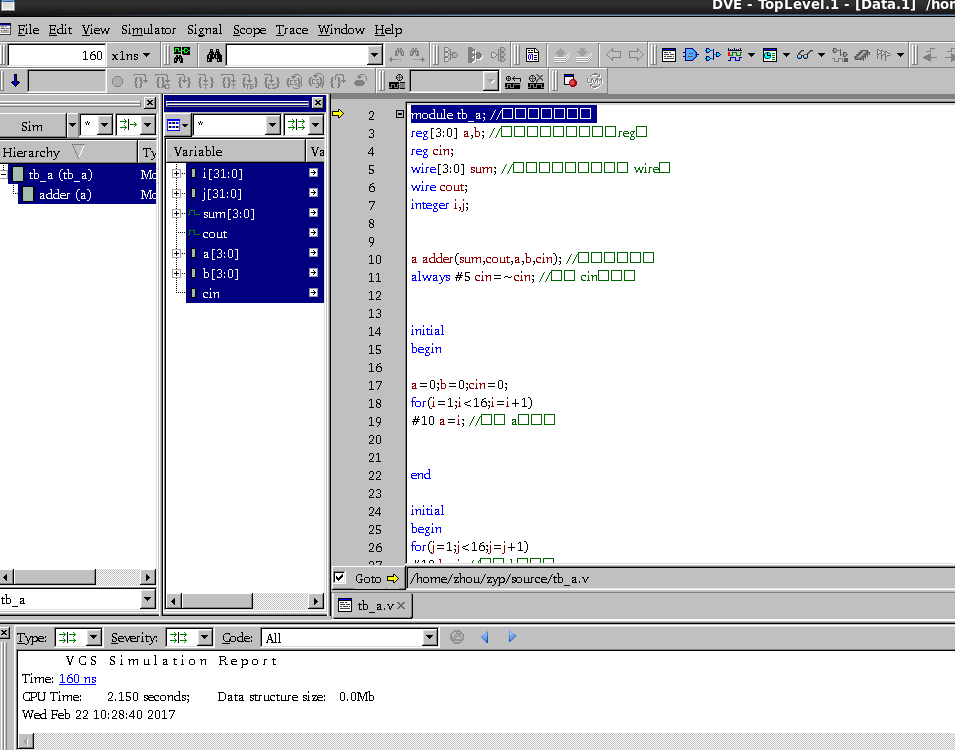

加入波形

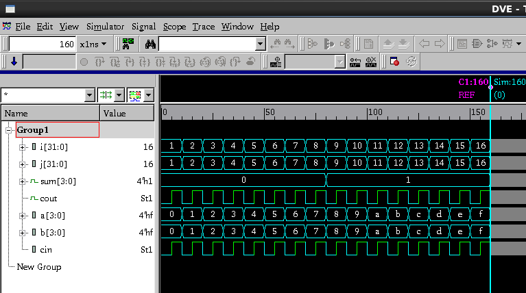

到此为止，VCS确认成功安装