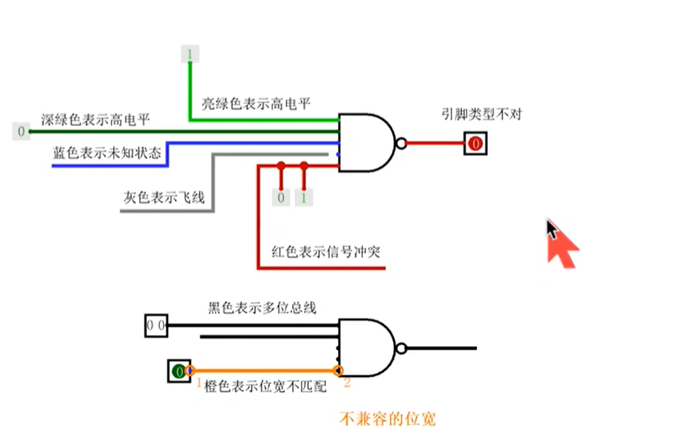

ALT + 数字键：可以改变引脚的位宽 

选中引脚然后按方向键可以改变他的朝向

选中引脚然后Crtl+D 可以直接创建它的副本

对于门，选中它，然后按对应的数字键，可以改变他的输入引脚

选中电路，然后可以根据属性设置数据位宽

Logisim中的延迟与险象

logisim中所有组件的延迟都是相同的。

.png)

能计数，因为延迟，会产生毛刺，导致计数器计数。可以通过单步调试发现。通过添加缓冲器（BUffer：直通，不会对输入进行任何处理，仅仅用于添加延迟），可以解决该问题，或者删除非门，修改与门，使其反转输入信号。

Logisim震荡现象

.png)

存在不恰当的反馈回路，造成电路无法稳定

可以通过单步调试发现

Logisim线路库

.png)

.png)

.png)

.png)

.png)

.png)

.png)

Logisim逻辑门库

.png)

Logisim复用器库

.png)

.png)

.png)

.png)

Logisim运算器库

.png)

.png)

.png)

.png)

.png)

.png)

.png)

Logisim存储库

.png)

.png)

.png)

.png)

.png)

.png)

.png)

.png)

.png)

Logisim输入输出库

.png)

.png)

.png)

.png)

