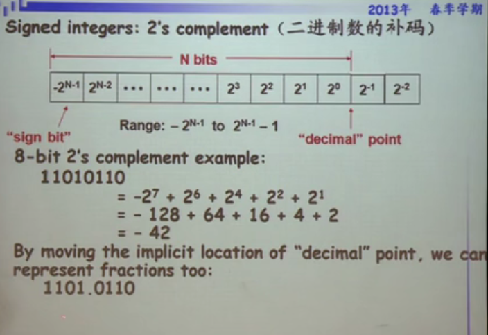

# What is "Information" ?

- Knowledge
- communicated or received concerning a particular fact or circumstance

Information resolves uncertainty(信息用于解决不确定性)

# Quantifying Information

香农

# 编码

Encoding describes the process of assigning representations to informtation

Chossing an appropriate and efficient encoding is a real engineering challenge

Impacts design at many levels
- Machanism
- Efficiency
- Reliability
- Security

