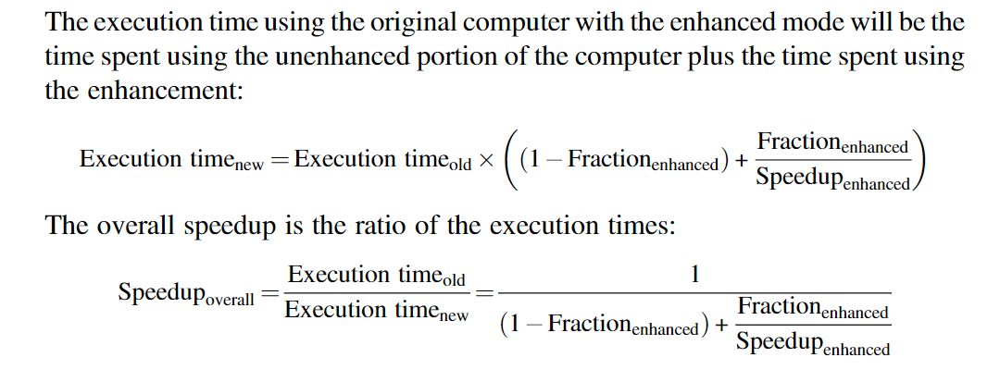

# 计算机分类

### IoT

收集有用的信息，并与物理世界交互

价格是该IoT关注的重点

### 手机(Personal Mobile Device)

响应性和可预测性是PMD关注的重点（交互能力）

PMD中的应用也要关注内存的最小使用与电池的最优使用

### 桌面电脑（Desktop Computing）

关注性价比

### 服务器(Services)

提供存储与计算

主要关注可用性、可扩展性、高吞吐

### 集群（Clusters/Warehouse-Scale Computers）

通过本地网络将桌面机器、服务器互联，然后向往展示为“一台计算机”

主要关注价格、电费、性能、可靠性

### 并行结构（Classes of Parallelism and Parallel Architectures）

应用程序中的并行性：

- 数据级并行(Data-level parallelism):多个数据项可以在同一时间进行操作
- 任务级并行(Task-level parallelism):线程？

硬件中的并行：

- 指令级并行(Instruction-level parallelism):利用流水线和预测执行(speculative execution)
- Vector architectures,graphic processor units(GPUs):单个指令操作一个数据项集合
- 线程级并行(Thread-level parallelism):
- 请求级并行(Requst-level parallelism):集群

所有计算机都可以分为以下几类：

- SISD(single instruction stream,single data stream)
- SIMD(single instruction stream,multiple data streams)
- MIMD(multiple instruction streams,multiple data streams)

# 定义计算机架构(Define Computer Architecture)

### 指令集架构(Instruction Set Architecture)

- ISA的分类：今天，几乎所以的ISA都是通用寄存器结构
- 内存寻址：字节寻址
- 寻址模式：寄存器、立即数、间接
- 操作数的大小：1，2，4，8字节
- 操作：数据传输、算数逻辑运算、流程控制、浮点
- 控制流指令：条件、无条件、过程调用、返回（return）
- ISA的编码：固定长度、可边长

### 真实的计算机架构(Genuine Computer Architecture:Designing the Organization and Hardware to Meet Goals and Functional Requirements)

计算机的实现有两个部分：组织（微架构）、硬件

Hardware refers to the specifies of a computer,including the detailed logic design and the packaging technology of the computer.

# 技术趋势(Trends in Technology)

- IC
- 内存技术
- 存储技术
- 网络技术

### 性能趋势：带宽（吞吐量）、延迟（Bandwidth Over Latency）

带宽（吞吐量）：在给定时间内，可以完成工作的数量

延迟（响应时间）：开始到完成一个事件的时间

### 晶体管性能和导线的缩放(Scaling of Transistor Performance and Wires)

晶体管的大小变小，导致单位面积上的晶体管更多，从而可以实现更多功能（早期是实现处理器从4-bit --》 64bit的改变，现在用来实现多核，SIMD单元、cache、预测执行）

# 集成电路中电源和功率的趋势（Trends in Power and Energy in Integrated Circuits）

### 功率与能量：系统角度（Power and Energy: A Systems Perspective）

- First,What is the maximum power a processor ever requires?Meeting this demand can be important to ensuring correct operation
- Second,What is the sustained power consumption.This metric is widely called the thermal design power(TDP) because it determines the cooling requirement.
- The third factor that designers and users need to consider is energy and energy efficiency.Recall that power is simply energy per unit time: 1 watt = 1 joule per second.Which metric is the right one for comparing processors:energy or power?In general,energy is always a better metric because it is tied to a specific task and the time required for that task.

### 微处理器中的能量和功率(Energy and Power Within a Microprocessor)

动态能量(dynamic energy)：对于CMOS芯片，传统的能量消耗主要是在晶体管的切换上。

能源效率提高（improve energy efficiency）

- Do nothing well.Most microprocessors today turn off the clock of inactive modules to save energy and dynamic power.
- Dynamic voltage-frequency scaling
- Design for the typical case
- Overclocking

# 成本趋势(Trends in Cost)

### 数量、时间、商品化的影响(The Impact of Time,Volume,and Commoditization)

- Time: 学习曲线：通过测试的设备的百分比会随着时间的流逝而增长，从而降低成本
- Volume: 大量的制造可以是单位设备的分摊花费更少
- 商品化：价格战、供应商之间的竞争也会导致花费更少

# 测试，报告，总结性能(Measuring,Reporting,and Summarizing Performance)

throughput(吞吐量)

response time(响应时间)

唯一一致和可靠的测试性能的方法是：正真程序的执行时间

CPU time

### Benchmarks

### Desktop Benchmarks

分为处理器密集型benchmark和图形密集型benchmark

### Server Benchmarks

处理器面向吞吐量的benchmark(processor throughtput-oriented benchmark)

面向IO的benchmark:file server benchmark

事务处理benchmark（Transaction-processing(TP)）测试系统处理事务时，数据库访问和更新的能力

# 计算机设计的量化原理（Quantitative Principles of Computer Design）

### 利用并行性(Take Advantage of Parallelism)

- 在系统级别上的并行（eg：在视频网站服务器请求较多时，通过增加处理器和存储设备）
- 单个处理器上的并行（流水线）
- 数字设计（缓存查找）

### 局部性原理

空间局部性和时间局部性

### 专注常用的情况(Focus on the Common Case)

优化常用的情况

### Amdahl's law

### 处理器性能方程(The Processor Performance Equation)

