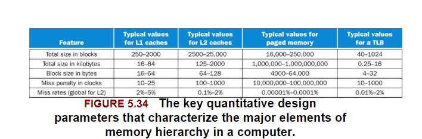

temporal locality:The locality principle stating that if a data location is referenced then it will tend to be referenced again soon.

spatial locality:The locality principle stating that if a data location is referenced,data locations with nearby addresses will tend to be referenced soon..

memory hierarchy:A structure that uses multiple levels of memories;as the distance from the processor increases,the size of the memories and the access time both increase.

.png)

block (or line):The minumum unit of information that can be either present or not present in a cache.

.png)

# Memory Technologies

.png)

### SRAM Technology

Don't need to refresh

### DRAM Technology

need refresh

.png)

# The Basics of Caches

### Direct-mapped cache

A cache structure in which each memory location is mapped to exactly one location in the cache.

.png)

.png)

Tag: A field in a table used for a memory hierarchy that contains the address information required to identify whether the associated block in the hierarchy corresponds to a requested word.The tag needs just to contain the upper portion of the address,corrsponding to the bits that are not used as an index into the cache.

valid bit:A field in the tables of a memory hierarchy that indicates that the associated block in the hierarchy contains valid data.

### Accessing a Cache

shows how a referenced address is divided into

- A tag field,which is used to compare with the value of the tag field of the cache.
- A cache index,which is used to select the block

.png)

.png)

### Handing Cache Misses

For a cache miss,we can stall the entire processor,essentially freezing the content of the temporary and programmer-visible registers,while we wait for memory.

steps to taken on an instruction cache miss:

- Send the original PC value to the memory.
- Instruct main memory to perform a read and wait for the memory to complete its access.
- Write the cache entry,putting the data from memory in the data portion of the entry,writing the uppers bits of the address into the tag field,and turning the valid bit on.
- Restart the instruction execution at the first step,which will refetch the instruction,this time finding it in the cache.

### Handing Writes

write-through

write-buffer

write-back

What occurs on a write miss: We first fetch the words of the block from memory.After the block is fetched and placed into the cache,we can overwrite the word that caused the miss into the cache block.We also write the word to main memory using the full address.

# Measuring and Improving Cache Performance

.png)

.png)

### Reducing Cache Misses by More Flexible Placement of Blocks

fully associative cache:A cache structure in which a block can be placed in any location in the cache.

set associative:A set-associative cache with n locations for a block is called an n-way set-associative cache.An n-way set-associative cache consists of a number of sets,each of which consists of n blocks.Each block in the memory maps to a unique set in the cache given by the index field,and a block can be placed in any element of that set.Thus,a set-associative placement combines direct-mapped placement and fully associative placement:a block is directly mapped into a set,and then all the blocks in the set are searched for a match.

.png)

A direct-mapped cache is just a one-way set-associative cache:each cache entry holds one block and each set has one element.A fully associative cache with m entries is simple an m-way set-associative cache;it has one set with m blocks,and an entry can reside in any block within that set.

### Loacting a Block in the Cache

Now,let's consider the task of finding a block in a cache this is set associative.

.png)

.png)

### Choosing Which Block to Replace

LRU

### Reducing the Miss Penalty Using Multilevel Caches

multilevel cache

First-level caches are more concerned about hit time,and second-level caches are more concerned about miss rate.

### Software Optimization via Blocking

### Summary

To reduce the miss rate,we examined the use of associative placement schemes.

We looked at multilevel caches as a technique to reduce the miss penalty by allowing a larger secondary cache to handle misses to the primary cache.

# Virtual Machines

- Reduce the cost of processor virtualization.
- Reduce interrupt overhead cost due to the virtualization.
- Reduce interrupt cost by steering(转移) interrupts to the proper VM without invoking VMM.

# Virtual Memory

### TLB(translation lookaside buffer)

Since the page tables are stored in main memory,every memory access by a program can take at least twice as long:one memory access to obtain the physical address and a second access to get the data.The key to improving access performance is to rely on locality of reference to the page table.When a translation for a virtual page number is used,it will probably be needed again soon,because the references to the words on that page have both temporal and spatial locality.

The TLB simply loads the physical address and protection tags from the last level page table.

.png)

After a TLB miss occurs and the missing translation has been retrieved from the page table,we will need to select a TLB entry to replace.Because the reference and dirty bits are contained in the TLB entry,we need to copy these bit back to page table entry when we replace an entry.These bits are the only portion of the TLB entry that can be changed.Using write-back -- this,copying these entries back at miss time rather than when they are written - is very efficient,since we expect the TLB miss rate to be small

.png)

### Integrating Virtual Memory,TLBs,and Caches

Our virtual memory and cache systems work together as a hierarchy,so that data cannot be in the cache unless it is present in main memory.

Under the best of circumstances(环境),a virtual address is translated by the TLB and sent to the cache where the appropriate data are found,retrieved,and sent back to the processor.In the worst case,a reference can miss in all three components of the memory hierarchy:The TLB,the page table,and the cache.

### Implementing Protection with Virtual Memory

address space ID(ASID):reduce TLB flush when process context switch

### Handing TLB Misses and Page Faults

TLB miss can indicate one of two possibilities:

- The page is present in memory,and we need only create the missing TLB entry.
- The page is not present in memory,and we need to transfer control to operating system to deal with a page fault.

Page fault exceptions for data accesses are difficult to implement properly in a processor because of a combination of three:

- They occur in the middle of instructions,unlike instruction page fault.
- The instruction cannot be completed before handling the exception
- After handling the exception,the instruction must be restarted as if nothing had occurred.

# A common Framework for Memory Hierarchy

### The Three Cs:An Intuitive(直观) Model for Understanding the Behavior of Memory Hierarchies

We look at a model that provides insight into the sources of misses in a memory hierarchy and how the misses will be affected by changes in the hierarchy.

In this model,all misses are classified into one of three categories:

- Compulsory misses:These are cache misses caused by the first access to a block that has never been in the cache.  
- Capacity misses:These are cache misses caused when the cache cannot contain all the blocks needed during execution of a program.Capacity misses occur when blocks are replaced and later retrieved.
- Conflict misses:These are cache misses that occur in set-associative or direct-mapped caches when multiple blocks compete for the same set.

.png)

# Using a Finite-State Machine to Control a Simple Cache

We can now build control for a cache.

### FSM for a Simple Cache Controller

# Parallelism and Memory Hierarchy: Cache Coherence

Cache一致性协议之MESI

https://blog.csdn.net/muxiqingyang/article/details/6615199