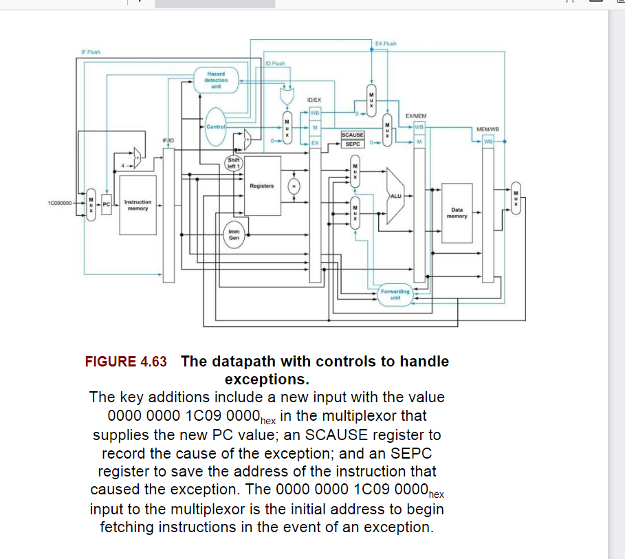
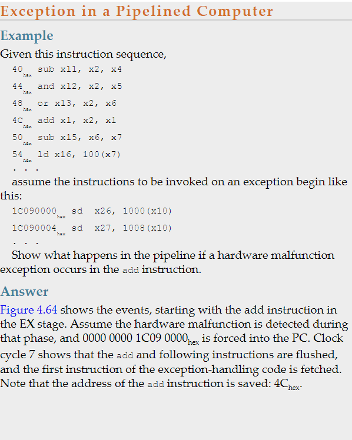
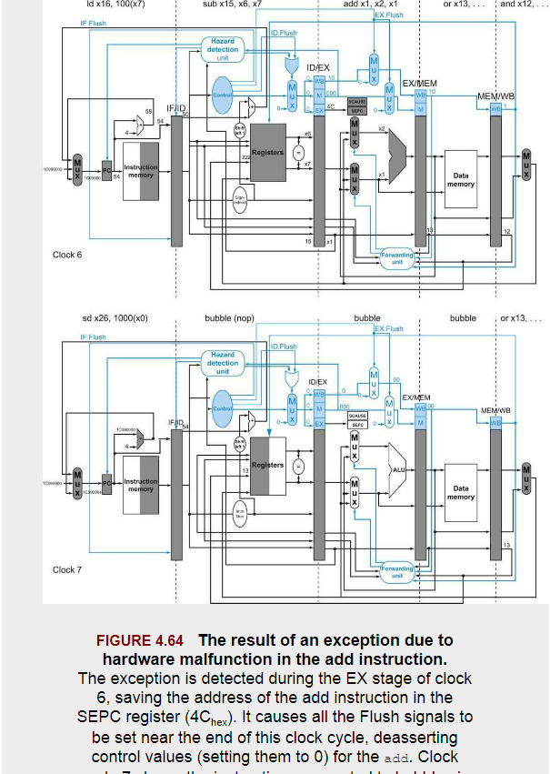
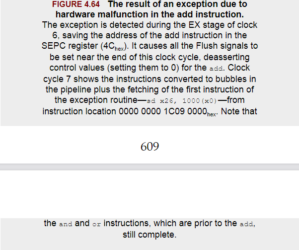

# How Exceptions are Handled in the RISC-V Architecture

The only types of exceptions that our current implementation can generate are execution of an undefined instruction or a hardware malfunction.

The basic action that the processor must perform when an exception occurs is to save the address of the unfortunate instruction in the supervisor exception cause register(SEPC) and then transfer control to the operating system at some specified address.

In the RISC-V architecture is to include a register(called the supervisor exception cause register or SCAUSE),which holds a field that indicate the reason for the exception.

# Exceptions in a Pipelined Implementation

A pipelined implementation treats exceptions as another form of control hazard.

