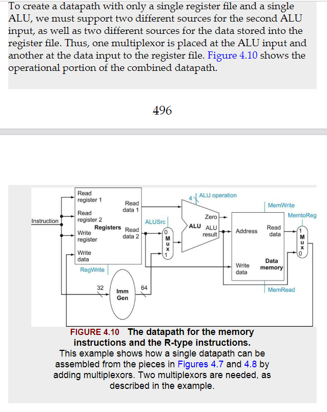

We will be examining an implementation that includes a subset of the core RISC-V instruction set:

- The memory-reference instructions load doubleword and store doubleword
- The arithmetic-logical instructions add,sub,and,or
- The conditional branch instruction branch if equal.(beq)

.png)

.png)

.png)

# 逻辑设计规范

The datapath elements in the RISC-V implementation consist of two different type of logic elements:elements that operate on data values and elements that contain state.

A state element has at least two inputs and one output.The required inputs are the data value to be written into the element and the clock,which determines when the data values is written.The output from a state element provides the value that was written in an earlier clock cycle.

The clock is used to determine when the state element should be written;a state element can be read at any time.

# 创建数据通路

In the RISC-V implementation,the datapath elements include the instruction and data memories,the register file,the ALU,and adders.

.png)

.png)

register file:A state element that consists of a set of registers that can be read and written by supplying a register number to be accessed.

.png)

.png)

.png)

### 创建单个数据通路

Now that we have examined the datapath components needed for the individual instruction classed,we can combine them into a single datapath and add the control to complete the implementation.This simplest datapath will attempt to execute all instructions in one clock cycle.This design means that no datapath resource can be used more than once per instruction,so any element needed more than once must be duplicated.

Now we can combine all the pieces to make a simple datapath for the core RISC-V architecture by adding the datapath for instruction fecth(Figure 4.6),the datapath from R-type and memory instructions(Figura 4.10),and the datapath for branches(Figure 4.9).

.png)

# 一个简单的实现方案

.png)

.png)

.png)

.png)

.png)

.png)

.png)

### 数据通路的操作

The operation of the datapath for an R-type instruction(add x1,x2,x3)

- The instruction is fetched,and the PC is incremented.
- Two registers,x2 and x3,are read from the register file;also,the main control unit computers the setting of the control lines during the step
- The ALU operates on the data read from the register file,using portions of the opcode to generate the ALU function
- The result from the ALU is written into the destination register(x1) in the register file.

.png)

The operation of the datapath for an load instruction(ld x1,offset(x2))

- An instruction is fetched from the instruction memory,and the PC is incremented
- A register(x2) values is read from the register file
- The ALU computes the sum of the value read from the register file and the sign-extended 12 bits of the instruction(offset)
- The sum from ALU is used as the address for the data memory
- The data from the memory unit is written into the register file(x1)

.png)

The operation of the datapath for an branch instruction(beq x1,x2,offset)

- An instruction is fetched from the instruction memory,and the PC is incremented.
- Two registers,x1 and x2,are read from the register file.
- The ALU subtracts one data value from the other data value,both read from the register file.The value of PC is added to the sign-extended,12 bits of the instruction(offset) left shifted by one;the result is the branch target address.
- The Zero status information from the ALU is used to decide which adder result to store in the PC

.png)

.png)

Although the single-cycle design will work correctly,it is too inefficient to be used in modern deisgn.To see why this is so,notice that the clock cycle must have the same length for every instruction in this single-cycle design.Of course,the longest possible path in the processor determines the clock cycle.