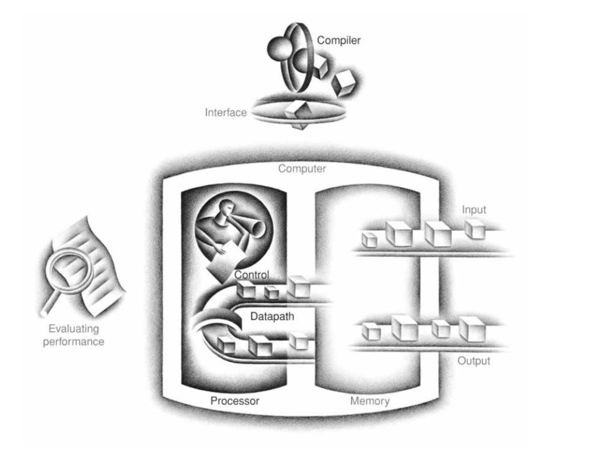

存储程序概念(stored-program concept)：指令和数据不加区分的保存在存储器中。这种计算机也叫做存储程序式计算机。


.png)
# 计算机硬件的操作

There must certainly be instructions for performing the fundamental arithmetic operations.（必须有执行基本算数运算的指令）


```risc-v
# risc-v中的加法运算:
add a,b,c # 操作数必须是3个，a = b+c
```

设计原则一：简单性倾向于规则性

在RISV-V中，像加法这样的算数指令，需要的操作数为三个，前一个操作数用于结果保存，后两个用于运算。

# 计算机硬件的操作数

RISC-V中的寄存器长度为64位，一共有32个寄存器，x加数字代表具体的那一个寄存器。其中x0寄存器中的值始终为0。

设计原则二：越小越快

计算机设计者通常要在程序需要更多寄存器和更快的时钟周期之间平衡。

### 内存操作

RISC-V指令中，算数运算仅仅作用在寄存器上。

数据传输指令（data transfer instructions）

从内存到寄存器eg：

```risc
ld x1,64(x2)
```

x2是base address , 64 是 offset

ld是 load doubleworld(64位)的缩写

从寄存器到内存

```risc
sd x1,64(x2)
```

sd是 store doubleworld的缩写

# 

这种有一个常量操作数的快速加法被称为add immediate,eg:

```
addi x22,x22,4
```

将常量包含在指令中，比从内存加载常量要快得多。

RISC-V中将寄存器x0，设置位常量0（common case fast）

# 在计算机中表示指令

RISC-V中的指令全是32位。

RISC-V指令字段（R-type）（P198,S-Type,I-Type）

```
---------------------------------------------------
|funct7 | rs2   | rs1   | funct3 | rd    | opcode |
---------------------------------------------------
|7bits  | 5bits | 5bits | 3bits  | 5bits | 7bits  |
---------------------------------------------------
```

opcode: 指令的基本操作

rd: 目标寄存器，保存操作结果

funct3: 额外的操作码字段

rs1: 第一个寄存器源操作数

rs2: 第二个寄存器源操作数

funct7：额外的操作码字段

在保持所有指令长度相同和拥有单一指令格式之间有一个折衷。

设计原则三：好的设计需要好的折衷。

RISC-V选择的折衷是保持指令长度相同，因此需要不同指令的格式对于不同类型的指令。

.png)

今天的计算机基于两个关键原则(stored-program:存储程序)：

- 指令用数字表示
- Programs are stored in memory to be read or written,just like data.

# 逻辑运算

.png)

# 条件指令

计算机和计算器的区别是：根据输入的数据，以及计算的结果，执行不同的指令。

RISC-V有两个决策指令：

```
beq rs1,rs2,L1
bne rs1,rs2,L2
```

beq == branch if equal

bne == branch if not equal

这两条指令被称为条件分支(conditional branches)

RISC-V中的无条件跳转是通过,beq x0,x0,Label 实现的，因为x0恒为0

### 循环

```c
while(save[i] == k)
    i+=1;
```

i:x22

k:x24

save:x25

```
Loop:slli x10,x22,3
add x10,x10,x25
ld x9,0(x10)
bne x9,x24,Exit
addi x22,x22,1
beq x0,x0,Loop
Exit:
```


# 过程调用

RISC-V中过程调用时，寄存器使用的规范：

- x10-x17:用于参数传递或返回值
- x1: 返回地址

jump-and-link instruction:

```
jal x1,ProcedureAddress // jump to ProcedureAddress and write return address to x1
```

返回到调用点：

```
jalr x0,0(x1)
```

RISC-V中的栈指针为x2

x5-x7 , x28 - x31:临时寄存器，在过程调用中不需要被保存
x8-x9 , x18 - x27:需要在过程调用中保存的寄存器

.png)


Procedure Frame: Also called activation record.The segment of the stack containing a procedure's saved registers and local variables.

Some RISC-V compilers use a frame pointer fp,or register x8 to point to the first doubleword of the frame of a procedure.But note that an Procedure frame appears on the stack whether or not an explicit frame pointer is used.We've been avoiding using fp by avoiding changes to sp within a procedure:in our examples,the stack is adjusted only on entry to and exit from the procedure.

.png)


```risc-v
long long int fact (long long int n)
{
    if (n < 1) return (1);
    else return (n * fact(n −1));
}


n: x10

fact:
addi sp,sp,-16
sd x1,8(sp)
sd x10,0(sp)
addi x5,x10,-1
bge x5,x0,L1
addi x10,x0,1
addi sp,sp,16
jalr x0,0(x1)
L1:
addi x10,x10,-1
jal x1,fact
addi x6,x10,0
ld x10,0(sp)
ld x1,8(sp)
add sp,sp,16
mul x10,x10,x6
jalr x0,0(x1)
```

# ASCII

```
lbu x12,0(x10) //read byte from source
sb  x12,0(x11) //write byte to destination
```

# RISC-V Addressing for Wide Immediates and Addresses

RISC-V指令包含Load upper immediate (lui)指令，用于将一个数加载到寄存器的12-31位，高32位填写为31位的值，低12位为0.

像最近的计算机一样，RISC-V使用PC相对跳转来实现条件跳转和无条件跳转。

RISC-V 支持32位长度的跳转， 通过lui 和 jalr 指令实现。

.png)


.png)

# Parallelism and Instructions: Synchronization

构建同步操作的典型是提供原子交换指令。

load-reserved doubleword(lr.d)

store-conditional doubleword(sc.d)

lr.d 返回初值，sc.d返回0 表示成功

```
again:
lr.d x10,(x20)          //load-reserved
sc.d x11,x23,(x20)      //store-conditional (exchange (x20) addr and x23 register, if success x11 == 0)
bne x11,x0,agin         //branch if store fails 
addi x23,x10,0          //put loaded value in x23
```

Any time a processor intervenes and modifies the value in memory between the lr.d and sc.d instructions,the sc.d writes a nonzero value into x11,causing the code sequence to try again.At the end of this sequence,the contents of x23 and the memory location specified by x20 have been atomically exchanged.

# 程序执行